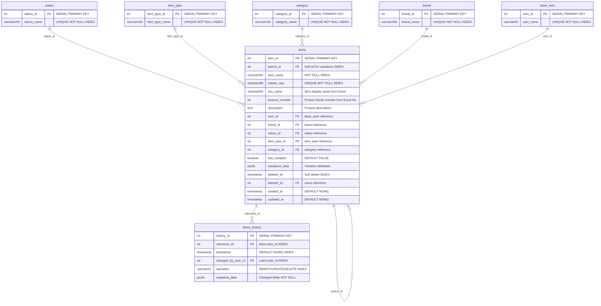
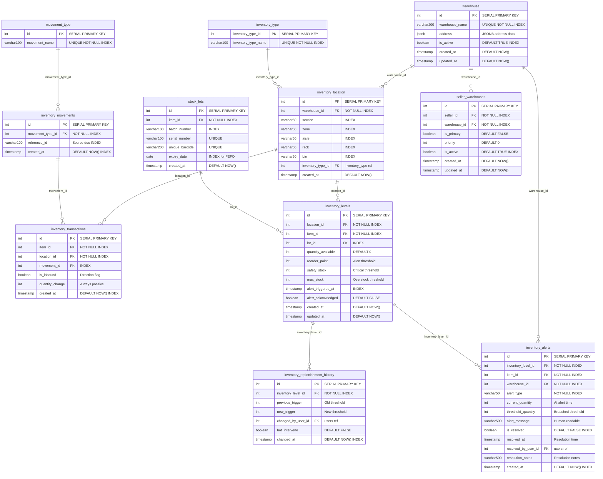
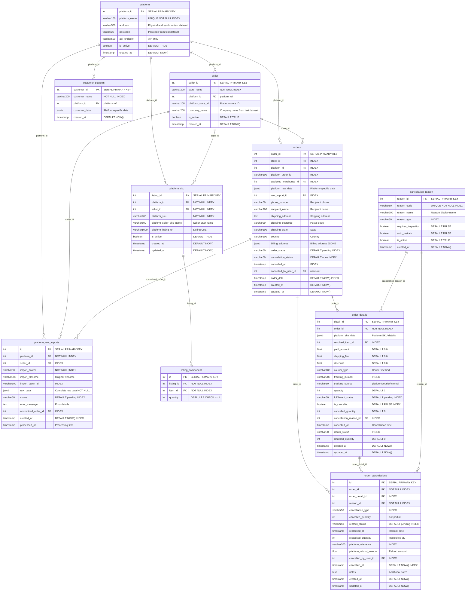
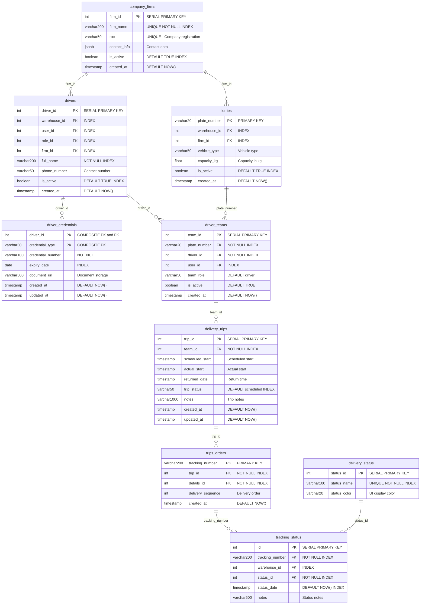

# WOMS Database Documentation

Complete database schema documentation for the Warehouse Order Management System (WOMS).

**Database:** PostgreSQL 13+  
**ORM:** SQLModel (SQLAlchemy + Pydantic)  
**Migration Tool:** Alembic  
**Total Tables:** 47  
**Total Views:** 12  

---

## Table of Contents

1. [Database Overview](#database-overview)
2. [Master Entity Relationship Diagram](#master-entity-relationship-diagram)
3. [Users Module](#users-module)
4. [Items Module](#items-module)
5. [Warehouse Module](#warehouse-module)
6. [Orders Module](#orders-module)
7. [Order Import Module](#order-import-module)
8. [Order Operations Module](#order-operations-module)
9. [Delivery Module](#delivery-module)
10. [Triggers](#triggers)
11. [Indexes](#indexes)
12. [Views](#views)
13. [Quick Reference](#quick-reference)

---

## Database Overview

### Module Summary

| Module | Tables | Description |
|--------|--------|-------------|
| **Users** | 4 | Authentication, authorization, action types, audit logging |
| **Items** | 7 | Product catalog, variations, categories, brands, version history |
| **Warehouse** | 11 | Physical locations, inventory tracking, alerts, stock management |
| **Orders** | 10 | Order processing, platform integration, SKU translation, cancellations |
| **Order Import** | 2 | Lazada/Shopee order uploads, raw copies, staging for normalization |
| **Order Operations** | 6 | Returns, exchanges, modifications, price adjustments |
| **Delivery** | 9 | Fleet management, drivers, trips, tracking status |
| **Total** | **47** | |

### Key Features

- **Version Control Snapshots** - Items history with JSONB for field-level change tracking
- **Multi-Platform Support** - Translator table bridges platform SKUs to internal items
- **Flexible Storage** - JSONB fields for addresses, customer data, permissions
- **Batch/Lot Tracking** - Support for FIFO, LIFO, FEFO inventory methods
- **Inventory Alerts** - Automatic low stock alerts with PostgreSQL triggers
- **Raw Data Preservation** - Store Excel/API imports for auditing
- **Order Import Schema** - Dedicated `order_import` schema for Lazada/Shopee uploads with seller_id and original copy preservation
- **Order Operations** - Full return, exchange, modification, and price adjustment workflows

### Migration Workflow

Schema changes use **Alembic** (Python migrations in `alembic/versions/`). Triggers, indexes, views, and seed data use SQL scripts in `migrations/`.

| Step | Command | Purpose |
|------|---------|---------|
| 1 | `alembic upgrade head` | Apply schema migrations (tables, columns) |
| 2 | `python -c "import asyncio; from app.database import run_migrations; asyncio.run(run_migrations())"` | Run triggers, indexes, views, seed data |

**Create a new schema migration** (after changing SQLModel in `app/models/`):

```bash
alembic revision --autogenerate -m "add_my_feature"
alembic upgrade head
```

See `migrations/README.md` for full documentation.

---

## Master Entity Relationship Diagram

```mermaid
erDiagram
    %% ========================================
    %% USERS MODULE
    %% ========================================
    action_type {
        int action_id PK
        varchar50 action_name UK
        varchar200 description
        timestamp created_at
    }
    
    roles {
        int role_id PK
        varchar100 role_name UK
        varchar500 description
        jsonb permissions
        timestamp created_at
    }
    
    users {
        int user_id PK
        varchar100 username UK
        varchar255 email UK
        text password_hash
        varchar100 first_name
        varchar100 last_name
        int role_id FK
        boolean is_active
        boolean is_superuser
        timestamp created_at
        timestamp updated_at
        timestamp last_login
    }
    
    audit_log {
        int audit_id PK
        varchar100 table_name
        varchar100 record_id
        int history_id FK
        int action_id FK
        jsonb old_data
        jsonb new_data
        int changed_by_user_id FK
        timestamp changed_at
        varchar50 ip_address
        varchar500 user_agent
    }

    %% ========================================
    %% ITEMS MODULE
    %% ========================================
    status {
        int status_id PK
        varchar100 status_name UK
    }
    
    item_type {
        int item_type_id PK
        varchar100 item_type_name UK
    }
    
    category {
        int category_id PK
        varchar100 category_name UK
    }
    
    brand {
        int brand_id PK
        varchar200 brand_name UK
    }
    
    base_uom {
        int uom_id PK
        varchar50 uom_name UK
    }
    
    items {
        int item_id PK
        int parent_id FK
        varchar500 item_name
        varchar100 master_sku UK
        varchar500 sku_name
        int product_number
        text description
        int uom_id FK
        int brand_id FK
        int status_id FK
        int item_type_id FK
        int category_id FK
        boolean has_variation
        jsonb variations_data
        timestamp deleted_at
        int deleted_by FK
        timestamp created_at
        timestamp updated_at
    }
    
    items_history {
        int history_id PK
        int reference_id FK
        timestamp timestamp
        int changed_by_user_id FK
        varchar20 operation
        jsonb snapshot_data
    }

    %% ========================================
    %% WAREHOUSE MODULE
    %% ========================================
    warehouse {
        int id PK
        varchar200 warehouse_name UK
        jsonb address
        boolean is_active
        timestamp created_at
        timestamp updated_at
    }
    
    inventory_type {
        int inventory_type_id PK
        varchar100 inventory_type_name UK
    }
    
    inventory_location {
        int id PK
        int warehouse_id FK
        varchar50 section
        varchar50 zone
        varchar50 aisle
        varchar50 rack
        varchar50 bin
        int inventory_type_id FK
        timestamp created_at
    }
    
    movement_type {
        int id PK
        varchar100 movement_name UK
    }
    
    inventory_movements {
        int id PK
        int movement_type_id FK
        varchar100 reference_id
        timestamp created_at
    }
    
    inventory_transactions {
        int id PK
        int item_id FK
        int location_id FK
        int movement_id FK
        boolean is_inbound
        int quantity_change
        timestamp created_at
    }
    
    stock_lots {
        int id PK
        int item_id FK
        varchar100 batch_number
        varchar100 serial_number UK
        varchar200 unique_barcode UK
        date expiry_date
        timestamp created_at
    }
    
    inventory_levels {
        int id PK
        int location_id FK
        int item_id FK
        int lot_id FK
        int quantity_available
        int reorder_point
        int safety_stock
        int max_stock
        timestamp alert_triggered_at
        boolean alert_acknowledged
        timestamp created_at
        timestamp updated_at
    }
    
    inventory_replenishment_history {
        int id PK
        int inventory_level_id FK
        int previous_trigger
        int new_trigger
        int changed_by_user_id FK
        boolean bot_intervene
        timestamp changed_at
    }
    
    inventory_alerts {
        int id PK
        int inventory_level_id FK
        int item_id FK
        int warehouse_id FK
        varchar50 alert_type
        int current_quantity
        int threshold_quantity
        varchar500 alert_message
        boolean is_resolved
        timestamp resolved_at
        int resolved_by_user_id FK
        varchar500 resolution_notes
        timestamp created_at
    }
    
    seller_warehouses {
        int id PK
        int seller_id FK
        int warehouse_id FK
        boolean is_primary
        int priority
        boolean is_active
        timestamp created_at
        timestamp updated_at
    }

    %% ========================================
    %% ORDERS MODULE
    %% ========================================
    platform {
        int platform_id PK
        varchar100 platform_name UK
        varchar500 address
        varchar20 postcode
        varchar500 api_endpoint
        boolean is_active
        timestamp created_at
    }
    
    seller {
        int seller_id PK
        varchar200 store_name
        int platform_id FK
        varchar100 platform_store_id
        varchar200 company_name
        boolean is_active
        timestamp created_at
    }
    
    platform_raw_imports {
        int id PK
        int platform_id FK
        int seller_id FK
        varchar50 import_source
        varchar500 import_filename
        varchar100 import_batch_id
        jsonb raw_data
        varchar50 status
        text error_message
        int normalized_order_id FK
        timestamp created_at
        timestamp processed_at
    }
    
    platform_sku {
        int listing_id PK
        int platform_id FK
        int seller_id FK
        varchar200 platform_sku
        varchar500 platform_seller_sku_name
        varchar1000 platform_listing_url
        boolean is_active
        timestamp created_at
        timestamp updated_at
    }
    
    listing_component {
        int id PK
        int listing_id FK
        int item_id FK
        int quantity
    }
    
    customer_platform {
        int customer_id PK
        varchar200 customer_name
        int platform_id FK
        jsonb customer_data
        timestamp created_at
    }
    
    cancellation_reason {
        int reason_id PK
        varchar50 reason_code UK
        varchar200 reason_name
        varchar50 reason_type
        boolean requires_inspection
        boolean auto_restock
        boolean is_active
        timestamp created_at
    }
    
    order_cancellations {
        int id PK
        int order_id FK
        int order_detail_id FK
        int reason_id FK
        varchar50 cancellation_type
        int cancelled_quantity
        varchar50 restock_status
        timestamp restocked_at
        int restocked_quantity
        varchar200 platform_reference
        float platform_refund_amount
        int cancelled_by_user_id FK
        timestamp cancelled_at
        text notes
        timestamp created_at
        timestamp updated_at
    }
    
    orders {
        int order_id PK
        int store_id FK
        int platform_id FK
        varchar100 platform_order_id
        int assigned_warehouse_id FK
        jsonb platform_raw_data
        int raw_import_id FK
        varchar50 phone_number
        varchar200 recipient_name
        text shipping_address
        varchar20 shipping_postcode
        varchar100 shipping_state
        varchar100 country
        jsonb billing_address
        varchar50 order_status
        varchar50 cancellation_status
        timestamp cancelled_at
        int cancelled_by_user_id FK
        timestamp order_date
        timestamp created_at
        timestamp updated_at
    }
    
    order_details {
        int detail_id PK
        int order_id FK
        jsonb platform_sku_data
        int resolved_item_id FK
        float paid_amount
        float shipping_fee
        float discount
        varchar100 courier_type
        varchar200 tracking_number
        varchar50 tracking_source
        int quantity
        varchar50 fulfillment_status
        boolean is_cancelled
        int cancelled_quantity
        int cancellation_reason_id FK
        timestamp cancelled_at
        varchar50 return_status
        int returned_quantity
        timestamp created_at
        timestamp updated_at
    }

    %% ========================================
    %% ORDER OPERATIONS MODULE
    %% ========================================
    return_reason {
        int reason_id PK
        varchar50 reason_code UK
        varchar200 reason_name
        varchar50 reason_type
        boolean requires_inspection
        boolean is_active
        timestamp created_at
    }
    
    order_returns {
        int id PK
        int order_id FK
        int order_detail_id FK
        varchar50 return_type
        int return_reason_id FK
        varchar50 return_status
        int returned_quantity
        varchar50 inspection_status
        text inspection_notes
        timestamp inspected_at
        int inspected_by_user_id FK
        varchar50 restock_decision
        int restocked_quantity
        timestamp restocked_at
        varchar200 platform_return_reference
        int initiated_by_user_id FK
        text notes
        timestamp requested_at
        timestamp approved_at
        timestamp received_at
        timestamp completed_at
        timestamp created_at
        timestamp updated_at
    }
    
    exchange_reason {
        int reason_id PK
        varchar50 reason_code UK
        varchar200 reason_name
        boolean requires_return
        boolean is_active
        timestamp created_at
    }
    
    order_exchanges {
        int id PK
        int original_order_id FK
        int original_detail_id FK
        varchar50 exchange_type
        int exchange_reason_id FK
        varchar50 exchange_status
        int new_order_id FK
        int new_detail_id FK
        int exchanged_item_id FK
        int exchanged_quantity
        float original_value
        float new_value
        float value_difference
        varchar50 adjustment_status
        int return_id FK
        varchar200 platform_exchange_reference
        int initiated_by_user_id FK
        int approved_by_user_id FK
        text notes
        timestamp requested_at
        timestamp approved_at
        timestamp completed_at
        timestamp created_at
        timestamp updated_at
    }
    
    order_modifications {
        int id PK
        int order_id FK
        int order_detail_id FK
        varchar50 modification_type
        varchar100 field_changed
        jsonb old_value
        jsonb new_value
        text modification_reason
        int related_exchange_id FK
        int related_return_id FK
        int modified_by_user_id FK
        timestamp modified_at
        timestamp created_at
    }
    
    order_price_adjustments {
        int id PK
        int order_id FK
        int order_detail_id FK
        varchar50 adjustment_type
        text adjustment_reason
        float original_amount
        float adjustment_amount
        float final_amount
        int related_exchange_id FK
        int related_modification_id FK
        varchar50 status
        int created_by_user_id FK
        int applied_by_user_id FK
        timestamp applied_at
        timestamp created_at
        timestamp updated_at
    }

    %% ========================================
    %% DELIVERY MODULE
    %% ========================================
    company_firms {
        int firm_id PK
        varchar200 firm_name UK
        varchar50 roc UK
        jsonb contact_info
        boolean is_active
        timestamp created_at
    }
    
    lorries {
        varchar20 plate_number PK
        int warehouse_id FK
        int firm_id FK
        varchar50 vehicle_type
        float capacity_kg
        boolean is_active
        timestamp created_at
    }
    
    drivers {
        int driver_id PK
        int warehouse_id FK
        int user_id FK
        int role_id FK
        int firm_id FK
        varchar200 full_name
        varchar50 phone_number
        boolean is_active
        timestamp created_at
    }
    
    driver_credentials {
        int driver_id PK "COMPOSITE PK and FK"
        varchar50 credential_type PK
        varchar100 credential_number
        date expiry_date
        varchar500 document_url
        timestamp created_at
        timestamp updated_at
    }
    
    driver_teams {
        int team_id PK
        varchar20 plate_number FK
        int driver_id FK
        int user_id FK
        varchar50 team_role
        boolean is_active
        timestamp created_at
    }
    
    delivery_trips {
        int trip_id PK
        int team_id FK
        timestamp scheduled_start
        timestamp actual_start
        timestamp returned_date
        varchar50 trip_status
        varchar1000 notes
        timestamp created_at
        timestamp updated_at
    }
    
    trips_orders {
        varchar200 tracking_number PK
        int trip_id FK
        int details_id FK
        int delivery_sequence
        timestamp created_at
    }
    
    delivery_status {
        int status_id PK
        varchar100 status_name UK
        varchar20 status_color
    }
    
    tracking_status {
        int id PK
        varchar200 tracking_number FK
        int warehouse_id FK
        int status_id FK
        timestamp status_date
        varchar500 notes
    }

    %% ========================================
    %% RELATIONSHIPS
    %% ========================================
    
    %% Users Module
    roles ||--o{ users : "role_id"
    roles ||--o{ drivers : "role_id"
    action_type ||--o{ audit_log : "action_id"
    users ||--o{ audit_log : "changed_by_user_id"
    items_history ||--o{ audit_log : "history_id"
    
    %% Items Module
    items ||--o{ items : "parent_id"
    status ||--o{ items : "status_id"
    item_type ||--o{ items : "item_type_id"
    category ||--o{ items : "category_id"
    brand ||--o{ items : "brand_id"
    base_uom ||--o{ items : "uom_id"
    users ||--o{ items : "deleted_by"
    items ||--o{ items_history : "reference_id"
    users ||--o{ items_history : "changed_by_user_id"
    
    %% Warehouse Module
    warehouse ||--o{ inventory_location : "warehouse_id"
    warehouse ||--o{ lorries : "warehouse_id"
    warehouse ||--o{ drivers : "warehouse_id"
    warehouse ||--o{ orders : "assigned_warehouse_id"
    warehouse ||--o{ seller_warehouses : "warehouse_id"
    warehouse ||--o{ inventory_alerts : "warehouse_id"
    warehouse ||--o{ tracking_status : "warehouse_id"
    inventory_type ||--o{ inventory_location : "inventory_type_id"
    inventory_location ||--o{ inventory_levels : "location_id"
    inventory_location ||--o{ inventory_transactions : "location_id"
    movement_type ||--o{ inventory_movements : "movement_type_id"
    inventory_movements ||--o{ inventory_transactions : "movement_id"
    items ||--o{ inventory_transactions : "item_id"
    items ||--o{ stock_lots : "item_id"
    items ||--o{ inventory_levels : "item_id"
    items ||--o{ inventory_alerts : "item_id"
    stock_lots ||--o{ inventory_levels : "lot_id"
    inventory_levels ||--o{ inventory_replenishment_history : "inventory_level_id"
    inventory_levels ||--o{ inventory_alerts : "inventory_level_id"
    users ||--o{ inventory_replenishment_history : "changed_by_user_id"
    users ||--o{ inventory_alerts : "resolved_by_user_id"
    seller ||--o{ seller_warehouses : "seller_id"
    
    %% Orders Module
    platform ||--o{ seller : "platform_id"
    platform ||--o{ platform_sku : "platform_id"
    platform ||--o{ orders : "platform_id"
    platform ||--o{ customer_platform : "platform_id"
    platform ||--o{ platform_raw_imports : "platform_id"
    seller ||--o{ platform_sku : "seller_id"
    seller ||--o{ orders : "store_id"
    seller ||--o{ platform_raw_imports : "seller_id"
    platform_sku ||--o{ listing_component : "listing_id"
    items ||--o{ listing_component : "item_id"
    items ||--o{ order_details : "resolved_item_id"
    orders ||--o{ order_details : "order_id"
    orders ||--o{ platform_raw_imports : "normalized_order_id"
    orders ||--o{ order_cancellations : "order_id"
    order_details ||--o{ order_cancellations : "order_detail_id"
    order_details ||--o{ trips_orders : "details_id"
    cancellation_reason ||--o{ order_cancellations : "reason_id"
    cancellation_reason ||--o{ order_details : "cancellation_reason_id"
    users ||--o{ orders : "cancelled_by_user_id"
    users ||--o{ order_cancellations : "cancelled_by_user_id"
    
    %% Order Operations Module
    return_reason ||--o{ order_returns : "return_reason_id"
    orders ||--o{ order_returns : "order_id"
    order_details ||--o{ order_returns : "order_detail_id"
    users ||--o{ order_returns : "initiated_by_user_id"
    users ||--o{ order_returns : "inspected_by_user_id"
    exchange_reason ||--o{ order_exchanges : "exchange_reason_id"
    orders ||--o{ order_exchanges : "original_order_id"
    orders ||--o{ order_exchanges : "new_order_id"
    order_details ||--o{ order_exchanges : "original_detail_id"
    order_details ||--o{ order_exchanges : "new_detail_id"
    items ||--o{ order_exchanges : "exchanged_item_id"
    order_returns ||--o{ order_exchanges : "return_id"
    users ||--o{ order_exchanges : "initiated_by_user_id"
    users ||--o{ order_exchanges : "approved_by_user_id"
    orders ||--o{ order_modifications : "order_id"
    order_details ||--o{ order_modifications : "order_detail_id"
    order_exchanges ||--o{ order_modifications : "related_exchange_id"
    order_returns ||--o{ order_modifications : "related_return_id"
    users ||--o{ order_modifications : "modified_by_user_id"
    orders ||--o{ order_price_adjustments : "order_id"
    order_details ||--o{ order_price_adjustments : "order_detail_id"
    order_exchanges ||--o{ order_price_adjustments : "related_exchange_id"
    order_modifications ||--o{ order_price_adjustments : "related_modification_id"
    users ||--o{ order_price_adjustments : "created_by_user_id"
    users ||--o{ order_price_adjustments : "applied_by_user_id"
    
    %% Delivery Module
    company_firms ||--o{ lorries : "firm_id"
    company_firms ||--o{ drivers : "firm_id"
    users ||--o{ drivers : "user_id"
    drivers ||--o{ driver_credentials : "driver_id"
    drivers ||--o{ driver_teams : "driver_id"
    lorries ||--o{ driver_teams : "plate_number"
    users ||--o{ driver_teams : "user_id"
    driver_teams ||--o{ delivery_trips : "team_id"
    delivery_trips ||--o{ trips_orders : "trip_id"
    trips_orders ||--o{ tracking_status : "tracking_number"
    delivery_status ||--o{ tracking_status : "status_id"
```

---

## Users Module

### Module ER Diagram



```mermaid
erDiagram
    action_type {
        int action_id PK "SERIAL PRIMARY KEY"
        varchar50 action_name "UNIQUE NOT NULL INDEX"
        varchar200 description "Optional description"
        timestamp created_at "DEFAULT NOW()"
    }
    
    roles {
        int role_id PK "SERIAL PRIMARY KEY"
        varchar100 role_name "UNIQUE NOT NULL INDEX"
        varchar500 description "Role description"
        jsonb permissions "Granular permissions"
        timestamp created_at "DEFAULT NOW()"
    }
    
    users {
        int user_id PK "SERIAL PRIMARY KEY"
        varchar100 username "UNIQUE NOT NULL INDEX"
        varchar255 email "UNIQUE NOT NULL INDEX"
        text password_hash "NOT NULL"
        varchar100 first_name "Optional"
        varchar100 last_name "Optional"
        int role_id FK "INDEX"
        boolean is_active "DEFAULT TRUE INDEX"
        boolean is_superuser "DEFAULT FALSE"
        timestamp created_at "DEFAULT NOW()"
        timestamp updated_at "DEFAULT NOW()"
        timestamp last_login "Nullable"
    }
    
    audit_log {
        int audit_id PK "SERIAL PRIMARY KEY"
        varchar100 table_name "NOT NULL INDEX"
        varchar100 record_id "INDEX"
        int history_id FK "INDEX - items_history link"
        int action_id FK "NOT NULL INDEX"
        jsonb old_data "Previous state"
        jsonb new_data "New state"
        int changed_by_user_id FK "INDEX"
        timestamp changed_at "DEFAULT NOW() INDEX"
        varchar50 ip_address "Client IP"
        varchar500 user_agent "Client user agent"
    }
    
    roles ||--o{ users : "role_id"
    action_type ||--o{ audit_log : "action_id"
    users ||--o{ audit_log : "changed_by_user_id"
```

### Table: `action_type`

Audit action type lookup table.

| Column | Type | Constraints | Description |
|--------|------|-------------|-------------|
| `action_id` | SERIAL | PRIMARY KEY | Unique identifier |
| `action_name` | VARCHAR(50) | UNIQUE, NOT NULL, INDEX | Action type name |
| `description` | VARCHAR(200) | | Action description |
| `created_at` | TIMESTAMP | DEFAULT NOW() | Creation timestamp |

**Sample Data:**
```sql
INSERT INTO action_type (action_name, description) VALUES 
('INSERT', 'New record created'),
('UPDATE', 'Record modified'),
('DELETE', 'Record deleted'),
('SOFT_DELETE', 'Record soft deleted'),
('RESTORE', 'Record restored from soft delete'),
('LOGIN', 'User logged in'),
('LOGOUT', 'User logged out'),
('EXPORT', 'Data exported'),
('IMPORT', 'Data imported');
```

---

### Table: `roles`

User role definitions with JSONB permissions.

| Column | Type | Constraints | Description |
|--------|------|-------------|-------------|
| `role_id` | SERIAL | PRIMARY KEY | Unique identifier |
| `role_name` | VARCHAR(100) | UNIQUE, NOT NULL, INDEX | Role name |
| `description` | VARCHAR(500) | | Role description |
| `permissions` | JSONB | | Role permissions |
| `created_at` | TIMESTAMP | DEFAULT NOW() | Creation timestamp |

**JSONB Structure - `permissions`:**
```json
{
  "items": ["read", "write", "delete"],
  "orders": ["read", "write"],
  "inventory": ["read", "write", "adjust"],
  "reports": ["read"],
  "users": ["read"]
}
```

**Sample Data:**
```sql
INSERT INTO roles (role_name, description) VALUES 
('Super Admin', 'Full system access'),
('Admin', 'Administrative access'),
('Manager', 'Warehouse manager'),
('Staff', 'Warehouse staff'),
('Driver', 'Delivery driver'),
('Picker', 'Order picker'),
('Packer', 'Order packer');
```

---

### Table: `users`

User account model with authentication.

| Column | Type | Constraints | Description |
|--------|------|-------------|-------------|
| `user_id` | SERIAL | PRIMARY KEY | Unique identifier |
| `username` | VARCHAR(100) | UNIQUE, NOT NULL, INDEX | Username |
| `email` | VARCHAR(255) | UNIQUE, NOT NULL, INDEX | Email address |
| `password_hash` | TEXT | NOT NULL | Hashed password |
| `first_name` | VARCHAR(100) | | First name |
| `last_name` | VARCHAR(100) | | Last name |
| `role_id` | INTEGER | FK → roles.role_id, INDEX | Role reference |
| `is_active` | BOOLEAN | DEFAULT TRUE, INDEX | Active status |
| `is_superuser` | BOOLEAN | DEFAULT FALSE | Superuser flag |
| `created_at` | TIMESTAMP | DEFAULT NOW() | Creation timestamp |
| `updated_at` | TIMESTAMP | DEFAULT NOW() | Last update timestamp |
| `last_login` | TIMESTAMP | | Last login timestamp |

---

### Table: `audit_log`

System-wide audit trail with JSONB change tracking.

| Column | Type | Constraints | Description |
|--------|------|-------------|-------------|
| `audit_id` | SERIAL | PRIMARY KEY | Unique identifier |
| `table_name` | VARCHAR(100) | NOT NULL, INDEX | Affected table |
| `record_id` | VARCHAR(100) | INDEX | Affected record PK |
| `history_id` | INTEGER | FK → items_history.history_id, INDEX | Items history link |
| `action_id` | INTEGER | FK → action_type.action_id, NOT NULL, INDEX | Action type reference |
| `old_data` | JSONB | | Previous state |
| `new_data` | JSONB | | New state |
| `changed_by_user_id` | INTEGER | FK → users.user_id, INDEX | User who made change |
| `changed_at` | TIMESTAMP | DEFAULT NOW(), INDEX | Change timestamp |
| `ip_address` | VARCHAR(50) | | Client IP address |
| `user_agent` | VARCHAR(500) | | Client user agent |

**JSONB Structure - `old_data` / `new_data`:**
```json
{
  "status_id": 1,
  "item_name": "Product Name",
  "updated_at": "2024-01-15T10:30:00Z"
}
```

---

## Items Module

### Module ER Diagram



### Table: `status`

Item status lookup table.

| Column | Type | Constraints | Description |
|--------|------|-------------|-------------|
| `status_id` | SERIAL | PRIMARY KEY | Unique identifier |
| `status_name` | VARCHAR(100) | UNIQUE, NOT NULL, INDEX | Status name |

**Sample Data:**
```sql
INSERT INTO status (status_name) VALUES 
('Active'), ('Inactive'), ('Discontinued'), ('Out of Stock'), ('Pending');
```

---

### Table: `item_type`

Item type classification.

| Column | Type | Constraints | Description |
|--------|------|-------------|-------------|
| `item_type_id` | SERIAL | PRIMARY KEY | Unique identifier |
| `item_type_name` | VARCHAR(100) | UNIQUE, NOT NULL, INDEX | Type name |

**Sample Data:**
```sql
INSERT INTO item_type (item_type_name) VALUES 
('Raw Material'), ('Finished Good'), ('Component'), ('Packaging'), ('Consumable');
```

---

### Table: `category`

Product category classification.

| Column | Type | Constraints | Description |
|--------|------|-------------|-------------|
| `category_id` | SERIAL | PRIMARY KEY | Unique identifier |
| `category_name` | VARCHAR(100) | UNIQUE, NOT NULL, INDEX | Category name |

**Sample Data:**
```sql
INSERT INTO category (category_name) VALUES 
('Electronics'), ('Clothing'), ('Food & Beverage'), ('Home & Living'), ('Beauty');
```

---

### Table: `brand`

Brand/manufacturer information.

| Column | Type | Constraints | Description |
|--------|------|-------------|-------------|
| `brand_id` | SERIAL | PRIMARY KEY | Unique identifier |
| `brand_name` | VARCHAR(200) | UNIQUE, NOT NULL, INDEX | Brand name |

---

### Table: `base_uom`

Base Unit of Measure definitions.

| Column | Type | Constraints | Description |
|--------|------|-------------|-------------|
| `uom_id` | SERIAL | PRIMARY KEY | Unique identifier |
| `uom_name` | VARCHAR(50) | UNIQUE, NOT NULL, INDEX | UOM name |

**Sample Data:**
```sql
INSERT INTO base_uom (uom_name) VALUES 
('Each'), ('Box'), ('Carton'), ('Kg'), ('Liter'), ('Pack'), ('Set');
```

---

### Table: `items`

Main item/product entity with variations support.

| Column | Type | Constraints | Description |
|--------|------|-------------|-------------|
| `item_id` | SERIAL | PRIMARY KEY | Unique identifier |
| `parent_id` | INTEGER | FK → items.item_id, INDEX | Parent item for variations |
| `item_name` | VARCHAR(500) | NOT NULL, INDEX | Product name |
| `master_sku` | VARCHAR(100) | UNIQUE, NOT NULL, INDEX | Internal SKU |
| `description` | TEXT | | Product description |
| `uom_id` | INTEGER | FK → base_uom.uom_id | Unit of measure |
| `brand_id` | INTEGER | FK → brand.brand_id | Brand reference |
| `status_id` | INTEGER | FK → status.status_id | Status reference |
| `item_type_id` | INTEGER | FK → item_type.item_type_id | Type reference |
| `category_id` | INTEGER | FK → category.category_id | Category reference |
| `has_variation` | BOOLEAN | DEFAULT FALSE | Has child variations |
| `variations_data` | JSONB | | Variation attributes |
| `deleted_at` | TIMESTAMP | INDEX | Soft delete timestamp |
| `deleted_by` | INTEGER | FK → users.user_id | User who deleted |
| `created_at` | TIMESTAMP | DEFAULT NOW() | Creation timestamp |
| `updated_at` | TIMESTAMP | DEFAULT NOW() | Last update timestamp |

**JSONB Structure - `variations_data`:**
```json
{
  "variation_type": "Color",
  "variation_name": "Red",
  "attributes": {
    "size": "XL",
    "weight": "500g"
  }
}
```

---

### Table: `items_history`

Version control snapshot for item changes.

| Column | Type | Constraints | Description |
|--------|------|-------------|-------------|
| `history_id` | SERIAL | PRIMARY KEY | Unique identifier |
| `reference_id` | INTEGER | FK → items.item_id, NOT NULL, INDEX | Referenced item |
| `timestamp` | TIMESTAMP | DEFAULT NOW(), INDEX | Change timestamp |
| `changed_by_user_id` | INTEGER | FK → users.user_id, INDEX | User who made change |
| `operation` | VARCHAR(20) | NOT NULL, INDEX | Operation type |
| `snapshot_data` | JSONB | NOT NULL | Changed fields snapshot |

**Operation Values:** `INSERT`, `UPDATE`, `DELETE`

**JSONB Structure - `snapshot_data`:**
```json
{
  "item_name": "New Name",
  "status_id": 2,
  "previous_values": {
    "item_name": "Old Name",
    "status_id": 1
  }
}
```

---

## Warehouse Module

### Module ER Diagram



### Table: `warehouse`

Physical warehouse locations.

| Column | Type | Constraints | Description |
|--------|------|-------------|-------------|
| `id` | SERIAL | PRIMARY KEY | Unique identifier |
| `warehouse_name` | VARCHAR(200) | UNIQUE, NOT NULL, INDEX | Warehouse name |
| `address` | JSONB | | Address data |
| `is_active` | BOOLEAN | DEFAULT TRUE, INDEX | Active status |
| `created_at` | TIMESTAMP | DEFAULT NOW() | Creation timestamp |
| `updated_at` | TIMESTAMP | DEFAULT NOW() | Last update timestamp |

**JSONB Structure - `address`:**
```json
{
  "street": "123 Industrial Park",
  "city": "Kuala Lumpur",
  "state": "Selangor",
  "postcode": "50000",
  "country": "Malaysia",
  "coordinates": {
    "lat": 3.1390,
    "lng": 101.6869
  }
}
```

---

### Table: `inventory_type`

Types of inventory locations.

| Column | Type | Constraints | Description |
|--------|------|-------------|-------------|
| `inventory_type_id` | SERIAL | PRIMARY KEY | Unique identifier |
| `inventory_type_name` | VARCHAR(100) | UNIQUE, NOT NULL, INDEX | Location type name |

**Sample Data:**
```sql
INSERT INTO inventory_type (inventory_type_name) VALUES 
('Bulk Storage'), ('Pick Face'), ('Receiving'), ('Staging'), ('Shipping'), ('Returns');
```

---

### Table: `inventory_location`

Specific location within a warehouse (Section > Zone > Aisle > Rack > Bin).

| Column | Type | Constraints | Description |
|--------|------|-------------|-------------|
| `id` | SERIAL | PRIMARY KEY | Unique identifier |
| `warehouse_id` | INTEGER | FK → warehouse.id, NOT NULL, INDEX | Parent warehouse |
| `section` | VARCHAR(50) | INDEX | Section code |
| `zone` | VARCHAR(50) | INDEX | Zone code |
| `aisle` | VARCHAR(50) | INDEX | Aisle code |
| `rack` | VARCHAR(50) | INDEX | Rack code |
| `bin` | VARCHAR(50) | INDEX | Bin code |
| `inventory_type_id` | INTEGER | FK → inventory_type.inventory_type_id | Location type |
| `created_at` | TIMESTAMP | DEFAULT NOW() | Creation timestamp |

**Example Location Code:** `A-01-03-R5-B12` (Section A, Zone 01, Aisle 03, Rack 5, Bin 12)

---

### Table: `movement_type`

Types of inventory movements.

| Column | Type | Constraints | Description |
|--------|------|-------------|-------------|
| `id` | SERIAL | PRIMARY KEY | Unique identifier |
| `movement_name` | VARCHAR(100) | UNIQUE, NOT NULL, INDEX | Movement type name |

**Sample Data:**
```sql
INSERT INTO movement_type (movement_name) VALUES 
('Receipt'), ('Shipment'), ('Transfer'), ('Adjustment'), ('Return'), ('Cycle Count'), ('Write Off');
```

---

### Table: `inventory_movements`

Inventory movement records (groups related transactions).

| Column | Type | Constraints | Description |
|--------|------|-------------|-------------|
| `id` | SERIAL | PRIMARY KEY | Unique identifier |
| `movement_type_id` | INTEGER | FK → movement_type.id, NOT NULL, INDEX | Movement type |
| `reference_id` | VARCHAR(100) | INDEX | Source document reference |
| `created_at` | TIMESTAMP | DEFAULT NOW(), INDEX | Creation timestamp |

---

### Table: `inventory_transactions`

Individual inventory transaction records.

| Column | Type | Constraints | Description |
|--------|------|-------------|-------------|
| `id` | SERIAL | PRIMARY KEY | Unique identifier |
| `item_id` | INTEGER | FK → items.item_id, NOT NULL, INDEX | Item reference |
| `location_id` | INTEGER | FK → inventory_location.id, NOT NULL, INDEX | Location reference |
| `movement_id` | INTEGER | FK → inventory_movements.id, INDEX | Parent movement |
| `is_inbound` | BOOLEAN | NOT NULL | Direction (TRUE=in, FALSE=out) |
| `quantity_change` | INTEGER | NOT NULL | Quantity changed (always positive) |
| `created_at` | TIMESTAMP | DEFAULT NOW(), INDEX | Transaction timestamp |

---

### Table: `stock_lots`

Batch/Lot tracking for items.

| Column | Type | Constraints | Description |
|--------|------|-------------|-------------|
| `id` | SERIAL | PRIMARY KEY | Unique identifier |
| `item_id` | INTEGER | FK → items.item_id, NOT NULL, INDEX | Item reference |
| `batch_number` | VARCHAR(100) | INDEX | Batch/lot number |
| `serial_number` | VARCHAR(100) | UNIQUE | Serial number (for serialized items) |
| `unique_barcode` | VARCHAR(200) | UNIQUE | Unique barcode |
| `expiry_date` | DATE | INDEX | Expiry date (for FEFO) |
| `created_at` | TIMESTAMP | DEFAULT NOW() | Creation timestamp |

---

### Table: `inventory_levels`

Current inventory level at a specific location with alert thresholds.

| Column | Type | Constraints | Description |
|--------|------|-------------|-------------|
| `id` | SERIAL | PRIMARY KEY | Unique identifier |
| `location_id` | INTEGER | FK → inventory_location.id, NOT NULL, INDEX | Location reference |
| `item_id` | INTEGER | FK → items.item_id, NOT NULL, INDEX | Item reference |
| `lot_id` | INTEGER | FK → stock_lots.id, INDEX | Lot reference (optional) |
| `quantity_available` | INTEGER | DEFAULT 0 | Current quantity |
| `reorder_point` | INTEGER | | Reorder threshold |
| `safety_stock` | INTEGER | | Safety stock threshold |
| `max_stock` | INTEGER | | Maximum stock threshold |
| `alert_triggered_at` | TIMESTAMP | INDEX | Last alert timestamp |
| `alert_acknowledged` | BOOLEAN | DEFAULT FALSE | Alert acknowledged flag |
| `created_at` | TIMESTAMP | DEFAULT NOW() | Creation timestamp |
| `updated_at` | TIMESTAMP | DEFAULT NOW() | Last update timestamp |

**Stock Status Logic:**
- `OUT_OF_STOCK`: quantity_available = 0
- `CRITICAL`: quantity_available <= safety_stock
- `LOW`: quantity_available <= reorder_point
- `OVERSTOCK`: quantity_available >= max_stock
- `OK`: All thresholds satisfied

---

### Table: `inventory_replenishment_history`

Tracks changes to replenishment triggers.

| Column | Type | Constraints | Description |
|--------|------|-------------|-------------|
| `id` | SERIAL | PRIMARY KEY | Unique identifier |
| `inventory_level_id` | INTEGER | FK → inventory_levels.id, NOT NULL, INDEX | Inventory level reference |
| `previous_trigger` | INTEGER | | Previous threshold value |
| `new_trigger` | INTEGER | | New threshold value |
| `changed_by_user_id` | INTEGER | FK → users.user_id | User who made change |
| `bot_intervene` | BOOLEAN | DEFAULT FALSE | Automated change flag |
| `changed_at` | TIMESTAMP | DEFAULT NOW(), INDEX | Change timestamp |

---

### Table: `inventory_alerts`

Inventory alert tracking for low stock and threshold breaches.

| Column | Type | Constraints | Description |
|--------|------|-------------|-------------|
| `id` | SERIAL | PRIMARY KEY | Unique identifier |
| `inventory_level_id` | INTEGER | FK → inventory_levels.id, NOT NULL, INDEX | Inventory level reference |
| `item_id` | INTEGER | FK → items.item_id, NOT NULL, INDEX | Item reference |
| `warehouse_id` | INTEGER | FK → warehouse.id, NOT NULL, INDEX | Warehouse reference |
| `alert_type` | VARCHAR(50) | NOT NULL, INDEX | Alert type |
| `current_quantity` | INTEGER | NOT NULL | Quantity at alert time |
| `threshold_quantity` | INTEGER | NOT NULL | Threshold that was breached |
| `alert_message` | VARCHAR(500) | | Human-readable message |
| `is_resolved` | BOOLEAN | DEFAULT FALSE, INDEX | Resolution status |
| `resolved_at` | TIMESTAMP | | Resolution timestamp |
| `resolved_by_user_id` | INTEGER | FK → users.user_id | User who resolved |
| `resolution_notes` | VARCHAR(500) | | Resolution notes |
| `created_at` | TIMESTAMP | DEFAULT NOW(), INDEX | Alert creation timestamp |

**Alert Types:**
- `out_of_stock` - Quantity is zero
- `critical` - Below safety stock
- `low_stock` - Below reorder point
- `overstock` - Above maximum stock

---

### Table: `seller_warehouses`

Seller-to-warehouse fulfillment routing.

| Column | Type | Constraints | Description |
|--------|------|-------------|-------------|
| `id` | SERIAL | PRIMARY KEY | Unique identifier |
| `seller_id` | INTEGER | FK → seller.seller_id, NOT NULL, INDEX | Seller reference |
| `warehouse_id` | INTEGER | FK → warehouse.id, NOT NULL, INDEX | Warehouse reference |
| `is_primary` | BOOLEAN | DEFAULT FALSE | Primary warehouse flag |
| `priority` | INTEGER | DEFAULT 0 | Priority order (lower = higher) |
| `is_active` | BOOLEAN | DEFAULT TRUE, INDEX | Active status |
| `created_at` | TIMESTAMP | DEFAULT NOW() | Creation timestamp |
| `updated_at` | TIMESTAMP | DEFAULT NOW() | Last update timestamp |

---

## Orders Module

### Module ER Diagram



### Table: `platform`

E-commerce platform definitions.

| Column | Type | Constraints | Description |
|--------|------|-------------|-------------|
| `platform_id` | SERIAL | PRIMARY KEY | Unique identifier |
| `platform_name` | VARCHAR(100) | UNIQUE, NOT NULL, INDEX | Platform name |
| `api_endpoint` | VARCHAR(500) | | API endpoint URL |
| `is_active` | BOOLEAN | DEFAULT TRUE | Active status |
| `created_at` | TIMESTAMP | DEFAULT NOW() | Creation timestamp |

**Sample Data:**
```sql
INSERT INTO platform (platform_name) VALUES 
('Shopee'), ('Lazada'), ('TikTok Shop'), ('Shopify'), ('WooCommerce'), ('Manual');
```

---

### Table: `seller`

Seller/store accounts on platforms.

| Column | Type | Constraints | Description |
|--------|------|-------------|-------------|
| `seller_id` | SERIAL | PRIMARY KEY | Unique identifier |
| `store_name` | VARCHAR(200) | NOT NULL, INDEX | Store name |
| `platform_id` | INTEGER | FK → platform.platform_id | Platform reference |
| `platform_store_id` | VARCHAR(100) | | Platform's store ID |
| `is_active` | BOOLEAN | DEFAULT TRUE | Active status |
| `created_at` | TIMESTAMP | DEFAULT NOW() | Creation timestamp |

---

### Table: `platform_raw_imports`

Raw platform data storage for Excel/API imports.

| Column | Type | Constraints | Description |
|--------|------|-------------|-------------|
| `id` | SERIAL | PRIMARY KEY | Unique identifier |
| `platform_id` | INTEGER | FK → platform.platform_id, NOT NULL, INDEX | Platform reference |
| `seller_id` | INTEGER | FK → seller.seller_id, INDEX | Seller reference |
| `import_source` | VARCHAR(50) | NOT NULL, INDEX | Source type |
| `import_filename` | VARCHAR(500) | | Original filename |
| `import_batch_id` | VARCHAR(100) | INDEX | Batch ID for grouping |
| `raw_data` | JSONB | NOT NULL | Complete raw data |
| `status` | VARCHAR(50) | DEFAULT 'pending', INDEX | Processing status |
| `error_message` | TEXT | | Error details |
| `normalized_order_id` | INTEGER | FK → orders.order_id, INDEX | Normalized order reference |
| `created_at` | TIMESTAMP | DEFAULT NOW(), INDEX | Import timestamp |
| `processed_at` | TIMESTAMP | | Processing timestamp |

**Import Source Values:** `excel`, `api`, `manual`

**Status Values:** `pending`, `processed`, `error`, `skipped`

**JSONB Structure - `raw_data` (Shopee Example):**
```json
{
  "Order ID": "2301234567890",
  "Order Status": "Completed",
  "SKU Reference No.": "SKU001",
  "Variation Name": "Red-XL",
  "Original Price": 50.00,
  "Deal Price": 45.00,
  "Quantity": 2,
  "Buyer Username": "buyer123",
  "Shipping Address": "123 Main St..."
}
```

---

### Table: `platform_sku`

Platform-specific product listings (SKU Translator).

| Column | Type | Constraints | Description |
|--------|------|-------------|-------------|
| `listing_id` | SERIAL | PRIMARY KEY | Unique identifier |
| `platform_id` | INTEGER | FK → platform.platform_id, NOT NULL, INDEX | Platform reference |
| `seller_id` | INTEGER | FK → seller.seller_id, NOT NULL, INDEX | Seller reference |
| `platform_sku` | VARCHAR(200) | NOT NULL, INDEX | Platform's SKU |
| `platform_seller_sku_name` | VARCHAR(500) | | Seller's SKU name |
| `platform_listing_url` | VARCHAR(1000) | | Listing URL |
| `is_active` | BOOLEAN | DEFAULT TRUE | Active status |
| `created_at` | TIMESTAMP | DEFAULT NOW() | Creation timestamp |
| `updated_at` | TIMESTAMP | DEFAULT NOW() | Last update timestamp |

---

### Table: `listing_component`

Links platform listings to internal items (supports bundles/kits).

| Column | Type | Constraints | Description |
|--------|------|-------------|-------------|
| `id` | SERIAL | PRIMARY KEY | Unique identifier |
| `listing_id` | INTEGER | FK → platform_sku.listing_id, NOT NULL, INDEX | Listing reference |
| `item_id` | INTEGER | FK → items.item_id, NOT NULL, INDEX | Internal item reference |
| `quantity` | INTEGER | DEFAULT 1, CHECK >= 1 | Quantity in listing |

---

### Table: `customer_platform`

Customer data per platform.

| Column | Type | Constraints | Description |
|--------|------|-------------|-------------|
| `customer_id` | SERIAL | PRIMARY KEY | Unique identifier |
| `customer_name` | VARCHAR(200) | NOT NULL, INDEX | Customer name |
| `platform_id` | INTEGER | FK → platform.platform_id | Platform reference |
| `customer_data` | JSONB | | Platform-specific customer data |
| `created_at` | TIMESTAMP | DEFAULT NOW() | Creation timestamp |

**JSONB Structure - `customer_data`:**
```json
{
  "platform_customer_id": "12345",
  "loyalty_tier": "Gold",
  "total_orders": 50,
  "phone": "+60123456789"
}
```

---

### Table: `cancellation_reason`

Lookup table for order/item cancellation reasons.

| Column | Type | Constraints | Description |
|--------|------|-------------|-------------|
| `reason_id` | SERIAL | PRIMARY KEY | Unique identifier |
| `reason_code` | VARCHAR(50) | UNIQUE, NOT NULL, INDEX | Reason code |
| `reason_name` | VARCHAR(200) | NOT NULL | Reason display name |
| `reason_type` | VARCHAR(50) | INDEX | Reason classification |
| `requires_inspection` | BOOLEAN | DEFAULT FALSE | Items need QC before restocking |
| `auto_restock` | BOOLEAN | DEFAULT FALSE | Auto return to inventory |
| `is_active` | BOOLEAN | DEFAULT TRUE | Active status |
| `created_at` | TIMESTAMP | DEFAULT NOW() | Creation timestamp |

**Reason Types:** `customer`, `seller`, `platform`, `delivery`, `system`

---

### Table: `order_cancellations`

Tracks order and item-level cancellations with full audit trail.

| Column | Type | Constraints | Description |
|--------|------|-------------|-------------|
| `id` | SERIAL | PRIMARY KEY | Unique identifier |
| `order_id` | INTEGER | FK → orders.order_id, NOT NULL, INDEX | Order reference |
| `order_detail_id` | INTEGER | FK → order_details.detail_id, INDEX | Line item (null = full order) |
| `reason_id` | INTEGER | FK → cancellation_reason.reason_id, NOT NULL, INDEX | Reason reference |
| `cancellation_type` | VARCHAR(50) | INDEX | Cancellation classification |
| `cancelled_quantity` | INTEGER | | Quantity cancelled |
| `restock_status` | VARCHAR(50) | DEFAULT 'pending', INDEX | Restock status |
| `restocked_at` | TIMESTAMP | | Restock timestamp |
| `restocked_quantity` | INTEGER | | Quantity restocked |
| `platform_reference` | VARCHAR(200) | INDEX | Platform refund/return ID |
| `platform_refund_amount` | FLOAT | | Refund amount |
| `cancelled_by_user_id` | INTEGER | FK → users.user_id, INDEX | User who cancelled |
| `cancelled_at` | TIMESTAMP | DEFAULT NOW(), INDEX | Cancellation timestamp |
| `notes` | TEXT | | Additional notes |
| `created_at` | TIMESTAMP | DEFAULT NOW() | Creation timestamp |
| `updated_at` | TIMESTAMP | DEFAULT NOW() | Last update timestamp |

**Cancellation Types:** `full_order`, `partial_item`, `return_to_sender`

**Restock Status Values:** `pending`, `auto_restocked`, `pending_inspection`, `qc_passed`, `qc_failed`, `disposed`

---

### Table: `orders`

Main order entity.

| Column | Type | Constraints | Description |
|--------|------|-------------|-------------|
| `order_id` | SERIAL | PRIMARY KEY | Unique identifier |
| `store_id` | INTEGER | FK → seller.seller_id, INDEX | Store/seller reference |
| `platform_id` | INTEGER | FK → platform.platform_id, INDEX | Platform reference |
| `platform_order_id` | VARCHAR(100) | INDEX | Platform's order ID |
| `assigned_warehouse_id` | INTEGER | FK → warehouse.id, INDEX | Fulfillment warehouse |
| `platform_raw_data` | JSONB | | Platform-specific order data |
| `raw_import_id` | INTEGER | FK → platform_raw_imports.id, INDEX | Raw import reference |
| `phone_number` | VARCHAR(50) | | Recipient phone |
| `recipient_name` | VARCHAR(200) | | Recipient name |
| `shipping_address` | TEXT | | Shipping address |
| `shipping_postcode` | VARCHAR(20) | | Postal code |
| `shipping_state` | VARCHAR(100) | | State/province |
| `country` | VARCHAR(100) | | Country |
| `billing_address` | JSONB | | Billing address (if different) |
| `order_status` | VARCHAR(50) | DEFAULT 'pending', INDEX | Order status |
| `cancellation_status` | VARCHAR(50) | DEFAULT 'none', INDEX | Cancellation status |
| `cancelled_at` | TIMESTAMP | INDEX | Cancellation timestamp |
| `cancelled_by_user_id` | INTEGER | FK → users.user_id | User who cancelled |
| `order_date` | TIMESTAMP | DEFAULT NOW(), INDEX | Order date |
| `created_at` | TIMESTAMP | DEFAULT NOW() | Creation timestamp |
| `updated_at` | TIMESTAMP | DEFAULT NOW() | Last update timestamp |

**Order Status Values:** `pending`, `confirmed`, `processing`, `packed`, `shipped`, `delivered`, `cancelled`, `returned`

**Cancellation Status Values:** `none`, `partial`, `full`, `return_pending`

**JSONB Structure - `billing_address`:**
```json
{
  "name": "John Doe",
  "address": "456 Business Ave",
  "city": "Petaling Jaya",
  "state": "Selangor",
  "postcode": "47800",
  "country": "Malaysia"
}
```

---

### Table: `order_details`

Order line items with pricing and tracking.

| Column | Type | Constraints | Description |
|--------|------|-------------|-------------|
| `detail_id` | SERIAL | PRIMARY KEY | Unique identifier |
| `order_id` | INTEGER | FK → orders.order_id, NOT NULL, INDEX | Parent order |
| `platform_sku_data` | JSONB | | Platform SKU details |
| `resolved_item_id` | INTEGER | FK → items.item_id, INDEX | Resolved internal item |
| `paid_amount` | FLOAT | DEFAULT 0.0 | Amount paid |
| `shipping_fee` | FLOAT | DEFAULT 0.0 | Shipping fee |
| `discount` | FLOAT | DEFAULT 0.0 | Discount amount |
| `courier_type` | VARCHAR(100) | | Courier/shipping method |
| `tracking_number` | VARCHAR(200) | INDEX | Tracking number |
| `tracking_source` | VARCHAR(50) | | Source of tracking |
| `quantity` | INTEGER | DEFAULT 1 | Quantity ordered |
| `fulfillment_status` | VARCHAR(50) | DEFAULT 'pending', INDEX | Fulfillment status |
| `is_cancelled` | BOOLEAN | DEFAULT FALSE, INDEX | Line item cancelled |
| `cancelled_quantity` | INTEGER | DEFAULT 0 | Cancelled quantity |
| `cancellation_reason_id` | INTEGER | FK → cancellation_reason.reason_id, INDEX | Cancellation reason |
| `cancelled_at` | TIMESTAMP | | Cancellation timestamp |
| `return_status` | VARCHAR(50) | INDEX | Return status |
| `returned_quantity` | INTEGER | DEFAULT 0 | Returned quantity |
| `created_at` | TIMESTAMP | DEFAULT NOW() | Creation timestamp |
| `updated_at` | TIMESTAMP | DEFAULT NOW() | Last update timestamp |

**Fulfillment Status Values:** `pending`, `picked`, `packed`, `shipped`, `delivered`, `cancelled`, `returned`

**Tracking Source Values:** `platform`, `courier`, `internal`

**Return Status Values:** `pending`, `in_transit`, `received`, `inspected`, `restocked`, `disposed`

**JSONB Structure - `platform_sku_data`:**
```json
{
  "platform_sku": "SHOP-SKU-001",
  "sku_name": "Red T-Shirt XL",
  "variation": "Red-XL",
  "original_price": 50.00,
  "unit_price": 45.00
}
```

---

## Order Import Module

Dedicated schema `order_import` for Lazada/Shopee order uploads. Stores original copies with `seller_id` to record which seller's orders each row belongs to.

**Why separate schema:** Isolates import tables from main WOMS schema; preserves raw data before normalization; supports multi-platform (Lazada 79 cols, Shopee 61 cols) via JSONB.

### Table: `order_import.order_import_raw`

Original copies of every Excel row. No transformation. Immutable.

| Column | Type | Constraints | Description |
|--------|------|-------------|-------------|
| `id` | BIGSERIAL | PRIMARY KEY | Unique identifier |
| `seller_id` | INTEGER | FK → seller.seller_id, NOT NULL, INDEX | **Which seller's orders this row belongs to** |
| `platform_source` | VARCHAR(50) | NOT NULL, INDEX | `lazada` or `shopee` |
| `import_batch_id` | VARCHAR(100) | INDEX | Batch identifier |
| `import_filename` | VARCHAR(500) | | Original filename |
| `excel_row_number` | INTEGER | | Row number in Excel |
| `raw_row_data` | JSONB | NOT NULL | **Complete original row** – all columns as key-value pairs |
| `imported_at` | TIMESTAMP | DEFAULT NOW() | Import timestamp |

### Table: `order_import.order_import_staging`

Parsed/normalized view for mapping to `orders` and `order_details`. Links to original via `raw_import_id`.

| Column | Type | Constraints | Description |
|--------|------|-------------|-------------|
| `id` | BIGSERIAL | PRIMARY KEY | Unique identifier |
| `seller_id` | INTEGER | FK → seller.seller_id, NOT NULL, INDEX | **Seller who owns this order** |
| `platform_source` | VARCHAR(50) | NOT NULL, INDEX | `lazada` or `shopee` |
| `platform_order_id` | VARCHAR(100) | INDEX | Order ID from platform |
| `order_date` | TIMESTAMP | | Parsed order date |
| `recipient_name` | VARCHAR(200) | | Shipping recipient |
| `shipping_address` | TEXT | | Full address |
| `shipping_postcode` | VARCHAR(20) | | |
| `shipping_state` | VARCHAR(100) | | |
| `country` | VARCHAR(100) | | |
| `platform_sku` | VARCHAR(200) | | Platform SKU |
| `sku_name` | VARCHAR(500) | | Product name |
| `variation_name` | VARCHAR(200) | | Variation |
| `quantity` | INTEGER | | Quantity |
| `unit_price` | DECIMAL(12,2) | | |
| `paid_amount` | DECIMAL(12,2) | | |
| `shipping_fee` | DECIMAL(12,2) | | |
| `discount` | DECIMAL(12,2) | | |
| `courier_type` | VARCHAR(100) | | |
| `tracking_number` | VARCHAR(200) | | |
| `manual_status` | VARCHAR(50) | | User-added status |
| `manual_driver` | VARCHAR(200) | | User-added driver (plate or name) |
| `manual_date` | DATE | | User-added date |
| `manual_note` | TEXT | | User-added note |
| `raw_row_data` | JSONB | | Copy of original |
| `raw_import_id` | BIGINT | FK → order_import.order_import_raw.id, INDEX | **Link to original copy** |
| `normalized_order_id` | INTEGER | FK → orders.order_id, INDEX | After processing |
| `created_at` | TIMESTAMP | DEFAULT NOW() | |
| `processed_at` | TIMESTAMP | | When normalized |

---

## Order Operations Module

### Module ER Diagram



```mermaid
erDiagram
    return_reason {
        int reason_id PK "SERIAL PRIMARY KEY"
        varchar50 reason_code "UNIQUE NOT NULL INDEX"
        varchar200 reason_name "Reason display name"
        varchar50 reason_type "INDEX"
        boolean requires_inspection "DEFAULT TRUE"
        boolean is_active "DEFAULT TRUE INDEX"
        timestamp created_at "DEFAULT NOW()"
    }
    
    order_returns {
        int id PK "SERIAL PRIMARY KEY"
        int order_id FK "NOT NULL INDEX"
        int order_detail_id FK "NOT NULL INDEX"
        varchar50 return_type "INDEX"
        int return_reason_id FK "return_reason ref"
        varchar50 return_status "DEFAULT requested INDEX"
        int returned_quantity "DEFAULT 1"
        varchar50 inspection_status "DEFAULT pending INDEX"
        text inspection_notes "QC notes"
        timestamp inspected_at "Inspection time"
        int inspected_by_user_id FK "users ref"
        varchar50 restock_decision "Post-QC decision"
        int restocked_quantity "DEFAULT 0"
        timestamp restocked_at "Restock time"
        varchar200 platform_return_reference "INDEX"
        int initiated_by_user_id FK "users ref"
        text notes "Additional notes"
        timestamp requested_at "DEFAULT NOW() INDEX"
        timestamp approved_at "Approval time"
        timestamp received_at "Receive time"
        timestamp completed_at "Completion time"
        timestamp created_at "DEFAULT NOW()"
        timestamp updated_at "DEFAULT NOW()"
    }
    
    exchange_reason {
        int reason_id PK "SERIAL PRIMARY KEY"
        varchar50 reason_code "UNIQUE NOT NULL INDEX"
        varchar200 reason_name "Reason display name"
        boolean requires_return "DEFAULT TRUE"
        boolean is_active "DEFAULT TRUE INDEX"
        timestamp created_at "DEFAULT NOW()"
    }
    
    order_exchanges {
        int id PK "SERIAL PRIMARY KEY"
        int original_order_id FK "NOT NULL INDEX"
        int original_detail_id FK "NOT NULL INDEX"
        varchar50 exchange_type "INDEX"
        int exchange_reason_id FK "exchange_reason ref"
        varchar50 exchange_status "DEFAULT requested INDEX"
        int new_order_id FK "INDEX"
        int new_detail_id FK "order_details ref"
        int exchanged_item_id FK "items ref"
        int exchanged_quantity "DEFAULT 1"
        float original_value "DEFAULT 0.0"
        float new_value "DEFAULT 0.0"
        float value_difference "DEFAULT 0.0"
        varchar50 adjustment_status "DEFAULT pending"
        int return_id FK "INDEX"
        varchar200 platform_exchange_reference "INDEX"
        int initiated_by_user_id FK "users ref"
        int approved_by_user_id FK "users ref"
        text notes "Additional notes"
        timestamp requested_at "DEFAULT NOW() INDEX"
        timestamp approved_at "Approval time"
        timestamp completed_at "Completion time"
        timestamp created_at "DEFAULT NOW()"
        timestamp updated_at "DEFAULT NOW()"
    }
    
    order_modifications {
        int id PK "SERIAL PRIMARY KEY"
        int order_id FK "NOT NULL INDEX"
        int order_detail_id FK "INDEX"
        varchar50 modification_type "INDEX"
        varchar100 field_changed "INDEX"
        jsonb old_value "Previous value"
        jsonb new_value "New value"
        text modification_reason "Change reason"
        int related_exchange_id FK "INDEX"
        int related_return_id FK "INDEX"
        int modified_by_user_id FK "INDEX"
        timestamp modified_at "DEFAULT NOW() INDEX"
        timestamp created_at "DEFAULT NOW()"
    }
    
    order_price_adjustments {
        int id PK "SERIAL PRIMARY KEY"
        int order_id FK "NOT NULL INDEX"
        int order_detail_id FK "INDEX"
        varchar50 adjustment_type "INDEX"
        text adjustment_reason "NOT NULL"
        float original_amount "DEFAULT 0.0"
        float adjustment_amount "DEFAULT 0.0"
        float final_amount "DEFAULT 0.0"
        int related_exchange_id FK "INDEX"
        int related_modification_id FK "INDEX"
        varchar50 status "DEFAULT pending INDEX"
        int created_by_user_id FK "users ref"
        int applied_by_user_id FK "users ref"
        timestamp applied_at "Application time"
        timestamp created_at "DEFAULT NOW() INDEX"
        timestamp updated_at "DEFAULT NOW()"
    }
    
    return_reason ||--o{ order_returns : "return_reason_id"
    order_returns ||--o{ order_exchanges : "return_id"
    exchange_reason ||--o{ order_exchanges : "exchange_reason_id"
    order_exchanges ||--o{ order_modifications : "related_exchange_id"
    order_returns ||--o{ order_modifications : "related_return_id"
    order_exchanges ||--o{ order_price_adjustments : "related_exchange_id"
    order_modifications ||--o{ order_price_adjustments : "related_modification_id"
```

### Table: `return_reason`

Lookup table for order return reasons.

| Column | Type | Constraints | Description |
|--------|------|-------------|-------------|
| `reason_id` | SERIAL | PRIMARY KEY | Unique identifier |
| `reason_code` | VARCHAR(50) | UNIQUE, NOT NULL, INDEX | Reason code |
| `reason_name` | VARCHAR(200) | NOT NULL | Reason display name |
| `reason_type` | VARCHAR(50) | INDEX | Reason classification |
| `requires_inspection` | BOOLEAN | DEFAULT TRUE | Items need QC inspection |
| `is_active` | BOOLEAN | DEFAULT TRUE, INDEX | Active status |
| `created_at` | TIMESTAMP | DEFAULT NOW() | Creation timestamp |

**Reason Types:** `customer`, `platform`, `delivery`, `quality`

---

### Table: `order_returns`

Tracks order return workflow including inspection and restocking.

| Column | Type | Constraints | Description |
|--------|------|-------------|-------------|
| `id` | SERIAL | PRIMARY KEY | Unique identifier |
| `order_id` | INTEGER | FK → orders.order_id, NOT NULL, INDEX | Order reference |
| `order_detail_id` | INTEGER | FK → order_details.detail_id, NOT NULL, INDEX | Line item reference |
| `return_type` | VARCHAR(50) | INDEX | Return classification |
| `return_reason_id` | INTEGER | FK → return_reason.reason_id | Reason reference |
| `return_status` | VARCHAR(50) | DEFAULT 'requested', INDEX | Return workflow status |
| `returned_quantity` | INTEGER | DEFAULT 1 | Quantity being returned |
| `inspection_status` | VARCHAR(50) | DEFAULT 'pending', INDEX | QC inspection status |
| `inspection_notes` | TEXT | | QC inspection notes |
| `inspected_at` | TIMESTAMP | | Inspection timestamp |
| `inspected_by_user_id` | INTEGER | FK → users.user_id | Inspector |
| `restock_decision` | VARCHAR(50) | | Post-inspection decision |
| `restocked_quantity` | INTEGER | DEFAULT 0 | Quantity restocked |
| `restocked_at` | TIMESTAMP | | Restock timestamp |
| `platform_return_reference` | VARCHAR(200) | INDEX | Platform return/refund ID |
| `initiated_by_user_id` | INTEGER | FK → users.user_id | User who initiated |
| `notes` | TEXT | | Additional notes |
| `requested_at` | TIMESTAMP | DEFAULT NOW(), INDEX | Request timestamp |
| `approved_at` | TIMESTAMP | | Approval timestamp |
| `received_at` | TIMESTAMP | | Receive timestamp |
| `completed_at` | TIMESTAMP | | Completion timestamp |
| `created_at` | TIMESTAMP | DEFAULT NOW() | Creation timestamp |
| `updated_at` | TIMESTAMP | DEFAULT NOW() | Last update timestamp |

**Return Types:** `customer_return`, `delivery_failed`, `platform_return`, `quality_issue`

**Return Status Values:** `requested`, `approved`, `rejected`, `in_transit`, `received`, `inspecting`, `completed`, `cancelled`

**Inspection Status Values:** `pending`, `passed`, `failed`, `partial`

**Restock Decision Values:** `restock`, `dispose`, `repair`, `exchange`, `pending`

---

### Table: `exchange_reason`

Lookup table for order exchange reasons.

| Column | Type | Constraints | Description |
|--------|------|-------------|-------------|
| `reason_id` | SERIAL | PRIMARY KEY | Unique identifier |
| `reason_code` | VARCHAR(50) | UNIQUE, NOT NULL, INDEX | Reason code |
| `reason_name` | VARCHAR(200) | NOT NULL | Reason display name |
| `requires_return` | BOOLEAN | DEFAULT TRUE | Original item must be returned |
| `is_active` | BOOLEAN | DEFAULT TRUE, INDEX | Active status |
| `created_at` | TIMESTAMP | DEFAULT NOW() | Creation timestamp |

---

### Table: `order_exchanges`

Tracks order exchange relationships and value adjustments.

| Column | Type | Constraints | Description |
|--------|------|-------------|-------------|
| `id` | SERIAL | PRIMARY KEY | Unique identifier |
| `original_order_id` | INTEGER | FK → orders.order_id, NOT NULL, INDEX | Original order |
| `original_detail_id` | INTEGER | FK → order_details.detail_id, NOT NULL, INDEX | Original line item |
| `exchange_type` | VARCHAR(50) | INDEX | Exchange classification |
| `exchange_reason_id` | INTEGER | FK → exchange_reason.reason_id | Reason reference |
| `exchange_status` | VARCHAR(50) | DEFAULT 'requested', INDEX | Exchange workflow status |
| `new_order_id` | INTEGER | FK → orders.order_id, INDEX | New order (for linked exchanges) |
| `new_detail_id` | INTEGER | FK → order_details.detail_id | New line item |
| `exchanged_item_id` | INTEGER | FK → items.item_id | New item (for in-place exchanges) |
| `exchanged_quantity` | INTEGER | DEFAULT 1 | Exchange quantity |
| `original_value` | FLOAT | DEFAULT 0.0 | Original item value |
| `new_value` | FLOAT | DEFAULT 0.0 | New item value |
| `value_difference` | FLOAT | DEFAULT 0.0 | Price difference (+/- |
| `adjustment_status` | VARCHAR(50) | DEFAULT 'pending' | Payment status |
| `return_id` | INTEGER | FK → order_returns.id, INDEX | Linked return record |
| `platform_exchange_reference` | VARCHAR(200) | INDEX | Platform exchange ID |
| `initiated_by_user_id` | INTEGER | FK → users.user_id | User who initiated |
| `approved_by_user_id` | INTEGER | FK → users.user_id | User who approved |
| `notes` | TEXT | | Additional notes |
| `requested_at` | TIMESTAMP | DEFAULT NOW(), INDEX | Request timestamp |
| `approved_at` | TIMESTAMP | | Approval timestamp |
| `completed_at` | TIMESTAMP | | Completion timestamp |
| `created_at` | TIMESTAMP | DEFAULT NOW() | Creation timestamp |
| `updated_at` | TIMESTAMP | DEFAULT NOW() | Last update timestamp |

**Exchange Types:** `same_value`, `different_value`, `in_place`

**Exchange Status Values:** `requested`, `approved`, `processing`, `shipped`, `completed`, `cancelled`

**Adjustment Status Values:** `pending`, `paid`, `waived`, `credited`, `not_applicable`

---

### Table: `order_modifications`

Full audit trail for all order changes.

| Column | Type | Constraints | Description |
|--------|------|-------------|-------------|
| `id` | SERIAL | PRIMARY KEY | Unique identifier |
| `order_id` | INTEGER | FK → orders.order_id, NOT NULL, INDEX | Order reference |
| `order_detail_id` | INTEGER | FK → order_details.detail_id, INDEX | Line item (null = order-level) |
| `modification_type` | VARCHAR(50) | INDEX | Modification classification |
| `field_changed` | VARCHAR(100) | INDEX | Specific field changed |
| `old_value` | JSONB | | Previous value |
| `new_value` | JSONB | | New value |
| `modification_reason` | TEXT | | Change reason |
| `related_exchange_id` | INTEGER | FK → order_exchanges.id, INDEX | Related exchange |
| `related_return_id` | INTEGER | FK → order_returns.id, INDEX | Related return |
| `modified_by_user_id` | INTEGER | FK → users.user_id, INDEX | User who modified |
| `modified_at` | TIMESTAMP | DEFAULT NOW(), INDEX | Modification timestamp |
| `created_at` | TIMESTAMP | DEFAULT NOW() | Creation timestamp |

**Modification Types:** `address`, `recipient`, `item_add`, `item_remove`, `item_change`, `quantity`, `pricing`, `shipping`, `other`

**JSONB Structure - `old_value` / `new_value`:**
```json
{
  "shipping_address": "123 Old Street",
  "shipping_state": "Selangor"
}
```

---

### Table: `order_price_adjustments`

Tracks order price adjustments including top-ups, reductions, and waivers.

| Column | Type | Constraints | Description |
|--------|------|-------------|-------------|
| `id` | SERIAL | PRIMARY KEY | Unique identifier |
| `order_id` | INTEGER | FK → orders.order_id, NOT NULL, INDEX | Order reference |
| `order_detail_id` | INTEGER | FK → order_details.detail_id, INDEX | Line item reference |
| `adjustment_type` | VARCHAR(50) | INDEX | Adjustment classification |
| `adjustment_reason` | TEXT | NOT NULL | Reason for adjustment |
| `original_amount` | FLOAT | DEFAULT 0.0 | Original amount |
| `adjustment_amount` | FLOAT | DEFAULT 0.0 | Adjustment (+/-) |
| `final_amount` | FLOAT | DEFAULT 0.0 | Final amount |
| `related_exchange_id` | INTEGER | FK → order_exchanges.id, INDEX | Related exchange |
| `related_modification_id` | INTEGER | FK → order_modifications.id, INDEX | Related modification |
| `status` | VARCHAR(50) | DEFAULT 'pending', INDEX | Adjustment status |
| `created_by_user_id` | INTEGER | FK → users.user_id | User who created |
| `applied_by_user_id` | INTEGER | FK → users.user_id | User who applied |
| `applied_at` | TIMESTAMP | | Application timestamp |
| `created_at` | TIMESTAMP | DEFAULT NOW(), INDEX | Creation timestamp |
| `updated_at` | TIMESTAMP | DEFAULT NOW() | Last update timestamp |

**Adjustment Types:** `top_up`, `reduction`, `waived`, `exchange_difference`, `discount`, `fee`, `correction`

**Status Values:** `pending`, `applied`, `cancelled`, `refunded`

---

## Delivery Module

### Module ER Diagram



### Table: `company_firms`

Logistics/transport company definitions.

| Column | Type | Constraints | Description |
|--------|------|-------------|-------------|
| `firm_id` | SERIAL | PRIMARY KEY | Unique identifier |
| `firm_name` | VARCHAR(200) | UNIQUE, NOT NULL, INDEX | Company name |
| `roc` | VARCHAR(50) | UNIQUE | Registration number |
| `contact_info` | JSONB | | Contact information |
| `is_active` | BOOLEAN | DEFAULT TRUE, INDEX | Active status |
| `created_at` | TIMESTAMP | DEFAULT NOW() | Creation timestamp |

**JSONB Structure - `contact_info`:**
```json
{
  "phone": "+60312345678",
  "email": "logistics@company.com",
  "address": "789 Transport Hub",
  "contact_person": "Ahmad"
}
```

---

### Table: `lorries`

Vehicle records for delivery fleet.

| Column | Type | Constraints | Description |
|--------|------|-------------|-------------|
| `plate_number` | VARCHAR(20) | PRIMARY KEY | Vehicle plate number |
| `warehouse_id` | INTEGER | FK → warehouse.id, INDEX | Assigned warehouse |
| `firm_id` | INTEGER | FK → company_firms.firm_id, INDEX | Owning company |
| `vehicle_type` | VARCHAR(50) | | Vehicle type |
| `capacity_kg` | FLOAT | | Capacity in kg |
| `is_active` | BOOLEAN | DEFAULT TRUE, INDEX | Active status |
| `created_at` | TIMESTAMP | DEFAULT NOW() | Creation timestamp |

---

### Table: `drivers`

Driver records.

| Column | Type | Constraints | Description |
|--------|------|-------------|-------------|
| `driver_id` | SERIAL | PRIMARY KEY | Unique identifier |
| `warehouse_id` | INTEGER | FK → warehouse.id, INDEX | Assigned warehouse |
| `user_id` | INTEGER | FK → users.user_id, INDEX | User account link |
| `role_id` | INTEGER | FK → roles.role_id, INDEX | Role reference |
| `firm_id` | INTEGER | FK → company_firms.firm_id, INDEX | Company reference |
| `full_name` | VARCHAR(200) | NOT NULL, INDEX | Driver name |
| `phone_number` | VARCHAR(50) | | Contact number |
| `is_active` | BOOLEAN | DEFAULT TRUE, INDEX | Active status |
| `created_at` | TIMESTAMP | DEFAULT NOW() | Creation timestamp |

---

### Table: `driver_credentials`

Driver credentials and documents (composite primary key).

| Column | Type | Constraints | Description |
|--------|------|-------------|-------------|
| `driver_id` | INTEGER | PK, FK → drivers.driver_id | Driver reference |
| `credential_type` | VARCHAR(50) | PK | Credential type |
| `credential_number` | VARCHAR(100) | NOT NULL | Credential number |
| `expiry_date` | DATE | INDEX | Expiry date |
| `document_url` | VARCHAR(500) | | Document storage URL |
| `created_at` | TIMESTAMP | DEFAULT NOW() | Creation timestamp |
| `updated_at` | TIMESTAMP | DEFAULT NOW() | Last update timestamp |

**Credential Types:** `driving_license`, `ic`, `passport`, `gdl`, `safety_cert`

---

### Table: `driver_teams`

Driver team composition (driver + vehicle + user account).

| Column | Type | Constraints | Description |
|--------|------|-------------|-------------|
| `team_id` | SERIAL | PRIMARY KEY | Unique identifier |
| `plate_number` | VARCHAR(20) | FK → lorries.plate_number, NOT NULL, INDEX | Vehicle reference |
| `driver_id` | INTEGER | FK → drivers.driver_id, NOT NULL, INDEX | Driver reference |
| `user_id` | INTEGER | FK → users.user_id, INDEX | User account reference |
| `team_role` | VARCHAR(50) | DEFAULT 'driver' | Role in team |
| `is_active` | BOOLEAN | DEFAULT TRUE | Active status |
| `created_at` | TIMESTAMP | DEFAULT NOW() | Creation timestamp |

**Team Roles:** `driver`, `helper`, `loader`

---

### Table: `delivery_trips`

Delivery trip records.

| Column | Type | Constraints | Description |
|--------|------|-------------|-------------|
| `trip_id` | SERIAL | PRIMARY KEY | Unique identifier |
| `team_id` | INTEGER | FK → driver_teams.team_id, NOT NULL, INDEX | Team reference |
| `scheduled_start` | TIMESTAMP | | Scheduled start time |
| `actual_start` | TIMESTAMP | | Actual start time |
| `returned_date` | TIMESTAMP | | Return timestamp |
| `trip_status` | VARCHAR(50) | DEFAULT 'scheduled', INDEX | Trip status |
| `notes` | VARCHAR(1000) | | Trip notes |
| `created_at` | TIMESTAMP | DEFAULT NOW() | Creation timestamp |
| `updated_at` | TIMESTAMP | DEFAULT NOW() | Last update timestamp |

**Trip Status Values:** `scheduled`, `in_progress`, `completed`, `cancelled`

---

### Table: `trips_orders`

Orders assigned to delivery trips.

| Column | Type | Constraints | Description |
|--------|------|-------------|-------------|
| `tracking_number` | VARCHAR(200) | PRIMARY KEY | Tracking number |
| `trip_id` | INTEGER | FK → delivery_trips.trip_id, NOT NULL, INDEX | Trip reference |
| `details_id` | INTEGER | FK → order_details.detail_id, NOT NULL, INDEX | Order detail reference |
| `delivery_sequence` | INTEGER | | Delivery order in trip |
| `created_at` | TIMESTAMP | DEFAULT NOW() | Creation timestamp |

---

### Table: `delivery_status`

Delivery status lookup table.

| Column | Type | Constraints | Description |
|--------|------|-------------|-------------|
| `status_id` | SERIAL | PRIMARY KEY | Unique identifier |
| `status_name` | VARCHAR(100) | UNIQUE, NOT NULL, INDEX | Status name |
| `status_color` | VARCHAR(20) | | UI display color |

**Sample Data:**
```sql
INSERT INTO delivery_status (status_name, status_color) VALUES 
('Pending', '#FFA500'),
('Picked Up', '#2196F3'),
('In Transit', '#9C27B0'),
('Out for Delivery', '#00BCD4'),
('Delivered', '#4CAF50'),
('Failed', '#F44336'),
('Returned', '#795548');
```

---

### Table: `tracking_status`

Order tracking status history.

| Column | Type | Constraints | Description |
|--------|------|-------------|-------------|
| `id` | SERIAL | PRIMARY KEY | Unique identifier |
| `tracking_number` | VARCHAR(200) | FK → trips_orders.tracking_number, NOT NULL, INDEX | Tracking reference |
| `warehouse_id` | INTEGER | FK → warehouse.id, INDEX | Location warehouse |
| `status_id` | INTEGER | FK → delivery_status.status_id, NOT NULL, INDEX | Status reference |
| `status_date` | TIMESTAMP | DEFAULT NOW(), INDEX | Status timestamp |
| `notes` | VARCHAR(500) | | Status notes |

---

## Triggers

| Trigger | Table | Event | Description |
|---------|-------|-------|-------------|
| `trg_items_timestamp` | items | BEFORE UPDATE | Auto-update `updated_at` |
| `trg_orders_timestamp` | orders | BEFORE UPDATE | Auto-update `updated_at` |
| `trg_order_details_timestamp` | order_details | BEFORE UPDATE | Auto-update `updated_at` |
| `trg_warehouse_timestamp` | warehouse | BEFORE UPDATE | Auto-update `updated_at` |
| `trg_inventory_levels_timestamp` | inventory_levels | BEFORE UPDATE | Auto-update `updated_at` |
| `trg_platform_sku_timestamp` | platform_sku | BEFORE UPDATE | Auto-update `updated_at` |
| `trg_seller_warehouses_timestamp` | seller_warehouses | BEFORE UPDATE | Auto-update `updated_at` |
| `trg_inventory_threshold_check` | inventory_levels | BEFORE UPDATE | Create alerts when thresholds breached |
| `trg_inventory_transaction` | inventory_transactions | AFTER INSERT | Auto-update inventory levels |
| `trg_auto_resolve_alerts` | inventory_levels | AFTER UPDATE | Auto-resolve alerts when stock replenished |

### Trigger Functions

**1. `update_timestamp()`** - Automatically updates `updated_at` column on row modification.

**2. `check_inventory_threshold()`** - Checks inventory levels and creates alerts when thresholds are breached:
- Creates `out_of_stock` alert when quantity = 0
- Creates `critical` alert when quantity <= safety_stock
- Creates `low_stock` alert when quantity <= reorder_point
- Creates `overstock` alert when quantity >= max_stock

**3. `update_inventory_on_transaction()`** - Updates inventory levels when transactions are recorded:
- Creates new inventory_level record if none exists
- Adjusts quantity based on is_inbound flag
- Prevents negative inventory (floors at 0)

**4. `auto_resolve_inventory_alerts()`** - Automatically resolves alerts when stock is replenished above thresholds.

---

## Indexes

### GIN Indexes (JSONB)

| Index | Table | Column | Purpose |
|-------|-------|--------|---------|
| `idx_items_variations_gin` | items | variations_data | Query item variations |
| `idx_orders_platform_raw_gin` | orders | platform_raw_data | Search platform data |
| `idx_orders_billing_address_gin` | orders | billing_address | Search billing addresses |
| `idx_order_details_sku_gin` | order_details | platform_sku_data | Search SKU data |
| `idx_customer_data_gin` | customer_platform | customer_data | Search customer data |
| `idx_warehouse_address_gin` | warehouse | address | Search warehouse addresses |
| `idx_raw_import_data_gin` | platform_raw_imports | raw_data | Search raw imports |
| `idx_company_contact_gin` | company_firms | contact_info | Search company contacts |
| `idx_roles_permissions_gin` | roles | permissions | Query permissions |
| `idx_items_history_snapshot_gin` | items_history | snapshot_data | Search change history |
| `idx_audit_old_data_gin` | audit_log | old_data | Search audit old data |
| `idx_audit_new_data_gin` | audit_log | new_data | Search audit new data |

### Composite Indexes

| Index | Table | Columns | Purpose |
|-------|-------|---------|---------|
| `idx_orders_platform_store` | orders | platform_id, store_id | Filter by platform/store |
| `idx_orders_warehouse_status` | orders | assigned_warehouse_id, order_status | Fulfillment queries |
| `idx_orders_date_status` | orders | order_date, order_status | Date range reporting |
| `idx_inventory_item_location` | inventory_levels | item_id, location_id | Stock lookups |
| `idx_inventory_location_lot` | inventory_levels | location_id, lot_id | FIFO/FEFO queries |
| `idx_platform_sku_seller` | platform_sku | seller_id, platform_id | Listing lookups |
| `idx_platform_sku_lookup` | platform_sku | platform_id, platform_sku | SKU translation |
| `idx_order_details_order_item` | order_details | order_id, resolved_item_id | Fulfillment queries |
| `idx_order_details_fulfillment` | order_details | fulfillment_status, order_id | Picking/packing |
| `idx_inventory_alerts_status_type` | inventory_alerts | is_resolved, alert_type | Dashboard queries |
| `idx_inventory_alerts_warehouse` | inventory_alerts | warehouse_id, is_resolved | Per-warehouse dashboard |
| `idx_seller_warehouses_active` | seller_warehouses | seller_id, is_active | Routing lookup |
| `idx_delivery_trips_team_status` | delivery_trips | team_id, trip_status | Trip scheduling |
| `idx_tracking_status_history` | tracking_status | tracking_number, status_date DESC | Status history |
| `idx_raw_imports_processing` | platform_raw_imports | status, platform_id | Processing queue |
| `idx_raw_imports_batch` | platform_raw_imports | import_batch_id | Batch processing |
| `idx_transactions_movement_date` | inventory_transactions | movement_id, created_at DESC | Transaction history |
| `idx_transactions_item_location` | inventory_transactions | item_id, location_id, created_at DESC | Item history |

### Partial Indexes

| Index | Table | Condition | Purpose |
|-------|-------|-----------|---------|
| `idx_items_active` | items | deleted_at IS NULL | Active items only |
| `idx_warehouse_active` | warehouse | is_active = TRUE | Active warehouses |
| `idx_sellers_active` | seller | is_active = TRUE | Active sellers |
| `idx_orders_pending` | orders | order_status = 'pending' | Pending order queue |
| `idx_alerts_unresolved` | inventory_alerts | is_resolved = FALSE | Active alerts |
| `idx_inventory_low_stock` | inventory_levels | alert_triggered_at IS NOT NULL | Low stock items |
| `idx_raw_imports_pending` | platform_raw_imports | status = 'pending' | Import queue |
| `idx_platform_sku_active` | platform_sku | is_active = TRUE | Active listings |

---

## Views

### `v_inventory_status`

Real-time inventory status with stock levels, alerts, and expiry tracking.

**Key Columns:** warehouse_name, item_name, master_sku, location_code, quantity_available, stock_status, expiry_status

**Stock Status Values:** `OK`, `LOW`, `CRITICAL`, `OUT_OF_STOCK`, `OVERSTOCK`

---

### `v_order_fulfillment`

Order fulfillment summary with aggregated amounts and status.

**Key Columns:** order_id, platform_name, store_name, total_line_items, total_amount, tracking_numbers, overall_fulfillment_status

---

### `v_seller_warehouse_routing`

Seller-warehouse assignments with fulfillment statistics.

**Key Columns:** seller_id, store_name, warehouse_name, is_primary, priority, total_orders_fulfilled

---

### `v_platform_import_status`

Raw import processing status with normalization tracking.

**Key Columns:** import_id, platform_name, import_source, status, normalized_to_order, processing_seconds

---

### `v_active_inventory_alerts`

Active alerts dashboard with priority ranking.

**Key Columns:** alert_id, alert_type, warehouse_name, item_name, current_quantity, hours_since_alert, priority_rank

---

### `v_warehouse_summary`

Warehouse summary with inventory and resource statistics.

**Key Columns:** warehouse_name, total_locations, unique_items, total_quantity, active_alerts, pending_orders

---

### `v_order_line_items`

Detailed order line items with SKU translation.

**Key Columns:** order_id, platform_sku, resolved_item_name, quantity, net_amount, fulfillment_status

---

### `v_order_returns`

Order returns with status, inspection, and restock tracking.

**Key Columns:** return_id, order_id, platform_sku, return_type, return_status, inspection_status, restock_decision

---

### `v_order_exchanges`

Order exchanges with original/new item details and value adjustments.

**Key Columns:** exchange_id, original_order_id, exchange_type, exchange_status, original_value, new_value, value_difference

---

### `v_order_modifications`

Order modification audit trail with old/new values.

**Key Columns:** modification_id, order_id, modification_type, field_changed, old_value, new_value, modified_by

---

### `v_order_price_adjustments`

Order price adjustments with related exchanges and modifications.

**Key Columns:** adjustment_id, order_id, adjustment_type, original_amount, adjustment_amount, final_amount, status

---

### `v_order_operations_summary`

Summary of all order operations including returns, exchanges, modifications, and adjustments.

**Key Columns:** order_id, total_returns, active_returns, total_exchanges, active_exchanges, total_modifications, total_adjustment_applied

---

## Quick Reference

### Migration Commands

```bash
alembic upgrade head          # Apply all schema migrations
alembic current               # Show current revision
alembic downgrade -1          # Rollback one migration
```

### Table Count by Module

```
Users:           4 tables
Items:           7 tables
Warehouse:      11 tables
Orders:         10 tables
Order Import:    2 tables (order_import schema)
Order Operations: 6 tables
Delivery:        9 tables
─────────────────────────────
Total:          47 tables + 12 views
```

### Common Queries

```sql
-- Get low stock items
SELECT * FROM v_inventory_status WHERE stock_status IN ('LOW', 'CRITICAL', 'OUT_OF_STOCK');

-- Get pending orders by warehouse
SELECT * FROM v_order_fulfillment WHERE overall_fulfillment_status = 'PENDING';

-- Get active alerts
SELECT * FROM v_active_inventory_alerts ORDER BY priority_rank, alert_created_at;

-- Search orders by platform data
SELECT * FROM orders WHERE platform_raw_data @> '{"Order Status": "Completed"}';

-- Get seller's warehouse assignments
SELECT * FROM v_seller_warehouse_routing WHERE seller_id = 1 ORDER BY priority;

-- Get order operations summary
SELECT * FROM v_order_operations_summary WHERE total_returns > 0 OR total_exchanges > 0;

-- Track order modifications
SELECT * FROM v_order_modifications WHERE order_id = 123 ORDER BY modified_at DESC;

-- Find pending returns needing inspection
SELECT * FROM v_order_returns WHERE return_status = 'received' AND inspection_status = 'pending';
```

### Status Value Enumerations

**Order Status:** `pending` → `confirmed` → `processing` → `packed` → `shipped` → `delivered`

**Fulfillment Status:** `pending` → `picked` → `packed` → `shipped` → `delivered`

**Return Workflow:** `requested` → `approved` → `in_transit` → `received` → `inspecting` → `completed`

**Exchange Workflow:** `requested` → `approved` → `processing` → `shipped` → `completed`

**Alert Priority:** `out_of_stock` (1) → `critical` (2) → `low_stock` (3) → `overstock` (4)

**Trip Status:** `scheduled` → `in_progress` → `completed`
