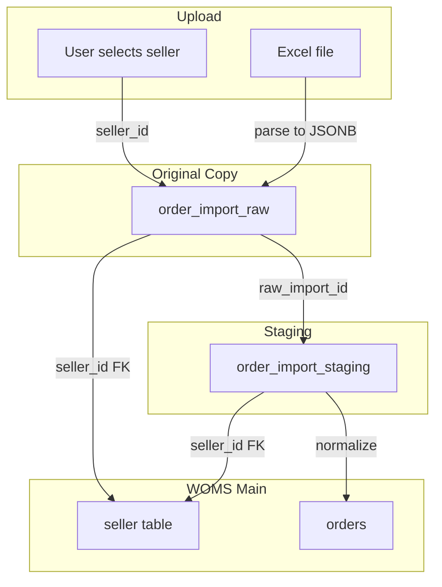

# Order Import Database Documentation

Import flow, seller_id usage, and original copy preservation for the `order_import` schema.

**Related:** [DATABASE.md](DATABASE.md) – Full schema reference

---

## Overview

The `order_import` schema stores Lazada and Shopee order data before normalization into the main WOMS `orders` and `order_details` tables. It provides:

1. **Seller ID tracking** – Every row records which seller's orders it belongs to
2. **Original copy preservation** – Raw Excel data stored unchanged in JSONB
3. **Staging for processing** – Normalized columns for mapping to WOMS schema

---

## Import Flow



### Steps

1. **User selects seller** – At import time, the user must select which `seller_id` the file belongs to (Excel exports are typically per-seller).
2. **Insert into `order_import_raw`** – Each Excel row is stored as one row with `raw_row_data` JSONB containing all columns.
3. **Parse into `order_import_staging`** – Extract normalized columns (order ID, recipient, SKU, amounts, manual tracking) and link via `raw_import_id`.
4. **Normalize into WOMS** – Map staging rows to `orders` and `order_details`, set `normalized_order_id` and `processed_at`.

---

## Seller ID Usage

### Requirement

**Neither Lazada nor Shopee Excel exports include an explicit seller/store ID.** Exports are per-seller (one file = one seller's orders). Therefore:

- `seller_id` is a **required import parameter** – user selects or system assigns it.
- Stored on every row in both `order_import_raw` and `order_import_staging`.
- FK to `seller.seller_id` ensures referential integrity.

### Query Examples

```sql
-- All raw imports for a seller
SELECT * FROM order_import.order_import_raw
WHERE seller_id = 1
ORDER BY imported_at DESC;

-- Staging rows by seller and platform
SELECT * FROM order_import.order_import_staging
WHERE seller_id = 1 AND platform_source = 'lazada'
  AND processed_at IS NULL;
```

---

## Original Copy Preservation

### Guarantee

- **`order_import_raw`** is append-only for imports; no updates or deletes of `raw_row_data`.
- Each Excel row → one `order_import_raw` row with full JSONB snapshot.
- `order_import_staging.raw_import_id` points back to the original.

### Query Pattern

To retrieve the original data for a processed order:

```sql
SELECT s.*, r.raw_row_data
FROM order_import.order_import_staging s
JOIN order_import.order_import_raw r ON s.raw_import_id = r.id
WHERE s.normalized_order_id = 123;
```

### Why JSONB

- Lazada: 79 columns
- Shopee: 61 columns

Storing as JSONB preserves the exact structure and values without schema changes when platforms add or remove columns.

---

## Manual Tracking Fields

User-added columns (last 4 in both Lazada and Shopee files):

| Column | Staging Field | Notes |
|--------|---------------|-------|
| status | `manual_status` | Free text (e.g. CANCELLED, Delivered) |
| Driver | `manual_driver` | Lazada: plate numbers; Shopee: driver names |
| Date | `manual_date` | D.M.Y format |
| note | `manual_note` | Free text |

---

## Migration

Schema and tables are created by Alembic migration:

```bash
alembic upgrade head
```

Migration: `20260220_1600_00_c4d5e6f7a8b9_create_order_import_schema.py`
