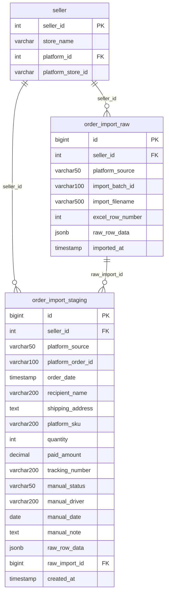
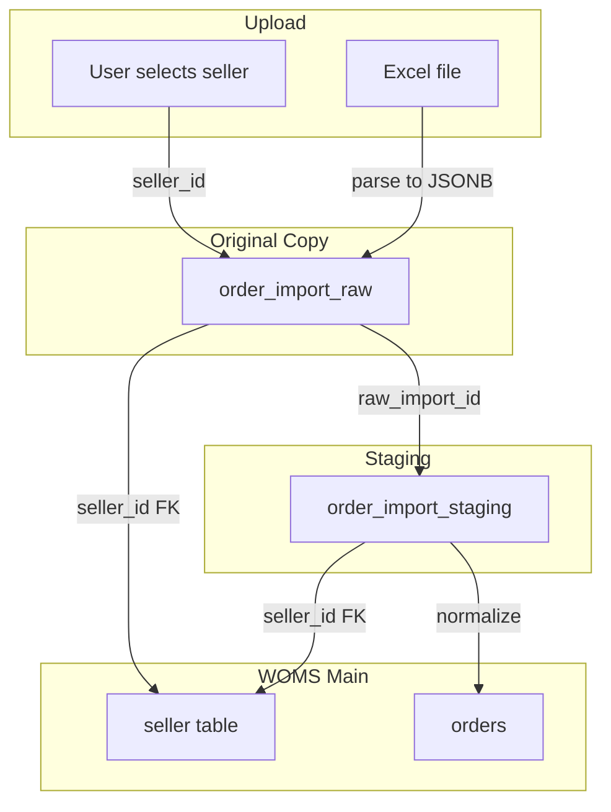

# Order Import Database Plan

## Objective

Create a dedicated database (or schema) for uploading Lazada and Shopee order data, with:

1. **Seller ID column** – Records which seller's orders each row belongs to
2. **Original copy preservation** – Stores raw imported data unchanged before normalization

---

## Architecture Options

| Option                          | Approach                                    | Pros                                                | Cons                                      |
| ------------------------------- | ------------------------------------------- | --------------------------------------------------- | ----------------------------------------- |
| **A: Separate database**        | New PostgreSQL DB `woms_order_import_db`    | Full isolation, independent backup/restore          | Extra connection, cross-DB queries harder |
| **B: New schema (recommended)** | Schema `order_import` in existing `woms_db` | Same connection, simpler config, can FK to `seller` | Shares same DB instance                   |

**Recommendation: Option B** – New schema `order_import` in `woms_db`. Keeps one connection, allows FK to `seller` for referential integrity, and isolates import tables from main schema.

---

## Proposed Structure

### Schema: `order_import`

---

## Table Definitions

### 1. `order_import.order_import_raw` (Original Copies)

**Purpose:** Store every Excel row exactly as imported. No transformation. Immutable record of what was uploaded.

| Column             | Type         | Description                                                             |
| ------------------ | ------------ | ----------------------------------------------------------------------- |
| `id`               | BIGSERIAL    | Primary key                                                             |
| `seller_id`        | INTEGER      | FK → `seller.seller_id` – **which seller's orders this row belongs to** |
| `platform_source`  | VARCHAR(50)  | `lazada` or `shopee`                                                    |
| `import_batch_id`  | VARCHAR(100) | Batch identifier (e.g. upload session ID)                               |
| `import_filename`  | VARCHAR(500) | Original filename (e.g. `LAZADA Test Data.xlsx`)                        |
| `excel_row_number` | INTEGER      | Row number in Excel (1-based, header=1)                                 |
| `raw_row_data`     | JSONB        | **Complete original row** – all columns as key-value pairs              |
| `imported_at`      | TIMESTAMP    | When the row was imported                                               |

**Why JSONB for `raw_row_data`:** Lazada has 79 columns, Shopee has 61. Storing as JSONB preserves the exact structure and values without schema changes when platforms add/remove columns.

**Indexes:** `seller_id`, `platform_source`, `import_batch_id`, `imported_at`

---

### 2. `order_import.order_import_staging` (Normalized for Processing)

**Purpose:** Parsed/normalized view for mapping to `orders` and `order_details`. Links back to original via `raw_import_id`.

| Column                | Type          | Description                                              |
| --------------------- | ------------- | -------------------------------------------------------- |
| `id`                  | BIGSERIAL     | Primary key                                              |
| `seller_id`           | INTEGER       | FK → `seller.seller_id` – **seller who owns this order** |
| `platform_source`     | VARCHAR(50)   | `lazada` or `shopee`                                     |
| `platform_order_id`   | VARCHAR(100)  | Order ID from platform                                   |
| `order_date`          | TIMESTAMP     | Parsed order date                                        |
| `recipient_name`      | VARCHAR(200)  | Shipping recipient                                       |
| `shipping_address`    | TEXT          | Full address                                             |
| `shipping_postcode`   | VARCHAR(20)   |                                                          |
| `shipping_state`      | VARCHAR(100)  |                                                          |
| `country`             | VARCHAR(100)  |                                                          |
| `platform_sku`        | VARCHAR(200)  | Platform SKU                                             |
| `sku_name`            | VARCHAR(500)  | Product name                                             |
| `variation_name`      | VARCHAR(200)  | Variation                                                |
| `quantity`            | INTEGER       | Quantity                                                 |
| `unit_price`          | DECIMAL(12,2) |                                                          |
| `paid_amount`         | DECIMAL(12,2) |                                                          |
| `shipping_fee`        | DECIMAL(12,2) |                                                          |
| `discount`            | DECIMAL(12,2) |                                                          |
| `courier_type`        | VARCHAR(100)  |                                                          |
| `tracking_number`     | VARCHAR(200)  |                                                          |
| `manual_status`       | VARCHAR(50)   | User-added status                                        |
| `manual_driver`       | VARCHAR(200)  | User-added driver (plate or name)                        |
| `manual_date`         | DATE          | User-added date                                          |
| `manual_note`         | TEXT          | User-added note                                          |
| `raw_row_data`        | JSONB         | Copy of original for reference                           |
| `raw_import_id`       | BIGINT        | FK → `order_import_raw.id` – **link to original copy**   |
| `normalized_order_id` | INTEGER       | FK → `orders.order_id` (after processing)                |
| `created_at`          | TIMESTAMP     |                                                          |
| `processed_at`        | TIMESTAMP     | When normalized into woms                                |

---

## Seller ID Flow

**Seller ID requirement:** At import time, the user must select (or system must assign) which `seller_id` the file belongs to. This is stored on every row in both `order_import_raw` and `order_import_staging`.

---

## Implementation Steps

### 1. Create Schema and Tables

- Add `order_import` schema to PostgreSQL
- Create `order_import_raw` and `order_import_staging` tables
- Add FK from `order_import_raw.seller_id` and `order_import_staging.seller_id` to `seller.seller_id`

### 2. Config and Migrations

- **Option A (separate DB):** Add `ORDER_IMPORT_DATABASE_NAME` to config, second engine for import DB
- **Option B (schema):** Single DB; Alembic migration creates `order_import` schema and tables

### 3. Models

- Create `app/models/order_import.py` with `OrderImportRaw` and `OrderImportStaging` SQLModel classes
- Register in `app/models/__init__.py`

### 4. Documentation

- Update [docs/DATABASE.md](docs/DATABASE.md) with new schema, tables, and reasoning
- Create `docs/ORDER_IMPORT_DATABASE.md` with import flow, seller_id usage, and original-copy preservation

### 5. Import Service

- Service that: (1) reads Excel, (2) inserts into `order_import_raw` with `seller_id` + `raw_row_data`, (3) parses into `order_import_staging` with `raw_import_id` link

---

## Files to Create/Modify

| File                                                                    | Action                                              |
| ----------------------------------------------------------------------- | --------------------------------------------------- |
| [alembic/versions/xxx_create_order_import_schema.py](alembic/versions/) | Create migration for schema + tables                |
| [app/models/order_import.py](app/models/order_import.py)                | Create OrderImportRaw, OrderImportStaging models    |
| [app/models/**init**.py](app/models/__init__.py)                        | Export new models                                   |
| [docs/DATABASE.md](docs/DATABASE.md)                                    | Add order_import schema section                     |
| [docs/ORDER_IMPORT_DATABASE.md](docs/ORDER_IMPORT_DATABASE.md)          | Create – import flow, seller_id, original copy docs |
| [app/config.py](app/config.py)                                          | Add ORDER_IMPORT_DATABASE_NAME if Option A          |

---

## Original Copy Guarantee

- `**order_import_raw**` is append-only for imports; no updates or deletes of `raw_row_data`
- Each Excel row → one `order_import_raw` row with full JSONB snapshot
- `order_import_staging.raw_import_id` points back to the original
- Query pattern: "Show me the original data for this order" → join staging to raw via `raw_import_id`

