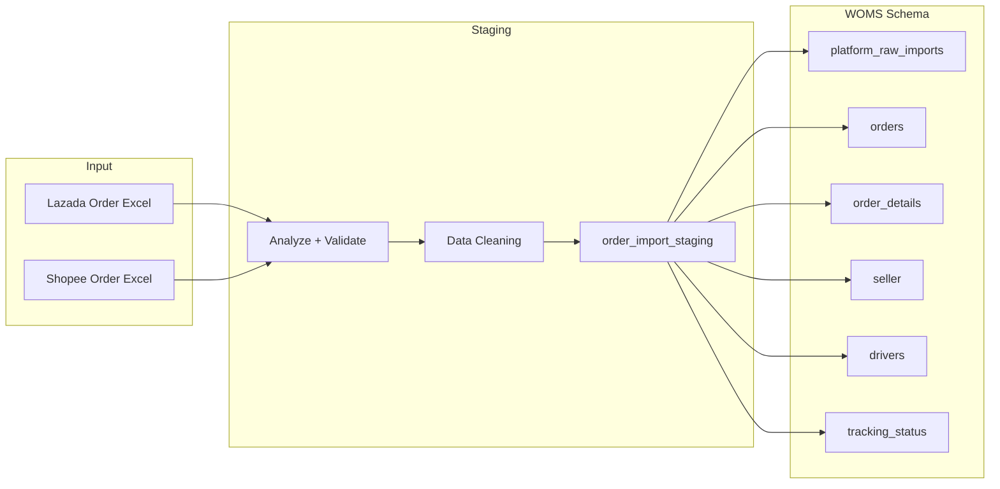

# Lazada and Shopee Order Template Table Plan

## Prerequisites

**Order files located at:** `e:\Desktop\bachelors of computer science\Final Year Project\`

- `LAZADA Test Data.xlsx` (121 rows, 79 columns)
- `Shopee Test Data.xlsx` (117 rows, 61 columns)

---

## Phase 1: File Analysis Results (Completed)

### 1.1 Actual Column Structures

**LAZADA (79 columns)** – Key columns:

- Identifiers: `orderItemId`, `lazadaId`, `orderNumber` (col 13), `sellerSku`, `lazadaSku`
- Customer: `customerName`, `customerEmail`, `shippingName`, `shippingAddress` (1–5), `shippingPhone`, `shippingCity`, `shippingPostCode`, `shippingCountry`, `shippingRegion`
- Item: `itemName`, `variation`, `paidPrice`, `unitPrice`, `sellerDiscountTotal`, `shippingFee`
- Courier: `cdShippingProvider`, `shippingProvider`, `cdTrackingCode`, `trackingCode`, `trackingUrl`
- Platform status: `status` (col 66) – **duplicate name**
- Manual tracking: `status` (col 76), `Driver`, `Date`, `note` (cols 76–79)

**SHOPEE (61 columns)** – Key columns:

- Identifiers: `Order ID`, `Order Status`, `Tracking Number*`, `Parent SKU Reference No.`, `SKU Reference No.`, `Variation Name`
- Dates: `Order Creation Date`, `Order Paid Time`, `Order Complete Time`
- Item: `Product Name`, `Original Price`, `Deal Price`, `Quantity`, `Total Amount`, `Grand Total`
- Shipping: `Receiver Name`, `Phone Number`, `Delivery Address`, `Town`, `District`, `Province`, `City`, `Country`, `Zip Code`
- Column 46: **empty header** (None)
- Manual tracking: `status`, `Driver`, `Date`, `note` (cols 58–61)

### 1.2 Data Quality Issues Identified


| Issue                  | Lazada                                                                                       | Shopee                                                                           |
| ---------------------- | -------------------------------------------------------------------------------------------- | -------------------------------------------------------------------------------- |
| Duplicate column names | `status` appears twice (col 66 platform, col 76 manual)                                      | None                                                                             |
| Empty header           | None                                                                                         | Col 46 is None                                                                   |
| Null-heavy columns     | `wareHouse`, `rtsSla`, `invoiceNumber`, `deliveredDate`, many address2/phone2, tracking URLs | `Return/Refund Status`, `Delivery Address` (19/20 null), `Zip Code` (20/20 null) |
| Manual Driver format   | Plate numbers: `MYIU0000942462`                                                              | Driver names: `Mathilagan ( S )`                                                 |
| Manual Date format     | `1.1.2024` (D.M.Y)                                                                           | `24.12.2025` (D.M.Y)                                                             |
| Manual status values   | Mostly null in sample                                                                        | `CANCELLED`, `Delivered`                                                         |


### 1.3 Seller ID Handling

**Neither file contains an explicit seller/store ID.** Exports appear to be per-seller (one seller per file). Resolution options:

- User selects seller during import
- Infer from filename or import metadata
- Add `seller_platform_id` as required import parameter (not from file)

---

## Phase 2: File Analysis and Validation (Original Spec)

### 1.1 Locate and Load Files

- Search for `.xlsx` or `.csv` order exports in project and test data paths
- Use `openpyxl` (already in use for platforms/sellers/items) or `pandas` for parsing
- Create `scripts/analyze_order_files.py` to:
  - List all columns per file
  - Detect column name variations (e.g. "Order ID" vs "OrderId")
  - Sample first 5 rows to infer types and null patterns

### 1.2 Data Quality Assessment

Document in `docs/ORDER_IMPORT_ANALYSIS.md`:


| Issue Type              | Detection Method            | Example                    |
| ----------------------- | --------------------------- | -------------------------- |
| Null values             | Count nulls per column      | `df.isnull().sum()`        |
| Unreadable chars        | Non-UTF8, control chars     | `[\x00-\x1f]`, BOM         |
| Inconsistent formatting | Date/phone/address patterns | Multiple date formats      |
| Duplicate columns       | Same semantic meaning       | "Status" vs "Order Status" |


### 1.3 Column Mapping (Platform-Specific)

Typical Lazada/Shopee export columns (to be validated against actual files):

**Common (both platforms):**

- Order ID, Order Status, SKU/Item, Quantity, Price, Buyer, Shipping Address, Tracking Number

**Lazada-specific:** Order number, created date, item status, platform fees

**Shopee-specific:** Order SN, deal price, buyer username, variation name

**Manual tracking (last 4 columns):** `status`, `Driver`, `Date`, `note`

---

## Phase 2: Unified Schema Design

### 2.1 Integration Strategy

WOMS already has a robust order model. Two approaches:

**Option A (Recommended): Extend existing schema**

- Use `platform_raw_imports.raw_data` (JSONB) for full raw preservation
- Add manual tracking columns to `orders` or `order_details` if not present
- Create a **staging view** or **materialized import template** that normalizes both platforms into a common column set

**Option B: New staging table**

- Create `order_import_staging` for pre-normalization storage
- One row per order line (Lazada/Shopee can have multiple lines per order)
- Columns: platform_source, seller_platform_id, raw columns as VARCHAR/TEXT, manual tracking fields

### 2.2 Proposed Template Table: `order_import_staging`

For raw import before normalization into `orders` / `order_details`:

```sql
CREATE TABLE order_import_staging (
    id SERIAL PRIMARY KEY,
    platform_source VARCHAR(50) NOT NULL,        -- 'lazada' | 'shopee'
    seller_platform_id VARCHAR(100) NOT NULL,   -- Platform's seller ID (string for both)
    import_batch_id VARCHAR(100),
    import_filename VARCHAR(500),
    
    -- Normalized from platform columns
    platform_order_id VARCHAR(100),
    order_date TIMESTAMP,
    order_status VARCHAR(50),
    recipient_name VARCHAR(200),
    phone_number VARCHAR(50),
    shipping_address TEXT,
    shipping_postcode VARCHAR(20),
    shipping_state VARCHAR(100),
    country VARCHAR(100),
    
    -- Line item (one row per line for multi-line orders)
    platform_sku VARCHAR(200),
    sku_name VARCHAR(500),
    variation_name VARCHAR(200),
    quantity INTEGER DEFAULT 1,
    unit_price DECIMAL(12,2),
    total_amount DECIMAL(12,2),
    shipping_fee DECIMAL(12,2),
    discount DECIMAL(12,2),
    courier_type VARCHAR(100),
    tracking_number VARCHAR(200),
    
    -- Manual tracking (user input - Lazada: plate no, Shopee: driver name)
    manual_status VARCHAR(50),
    manual_driver VARCHAR(200),   -- Plate (MYIU...) or name (Mathilagan) before resolution
    manual_date DATE,
    manual_note TEXT,
    
    -- Raw preservation + AI readiness
    raw_data JSONB,
    data_quality_flags JSONB,                   -- e.g. {"nulls": [...], "warnings": [...]}
    
    created_at TIMESTAMP DEFAULT NOW(),
    processed_at TIMESTAMP,
    normalized_order_id INTEGER REFERENCES orders(order_id)
);
```

**Why this design:**

- `seller_platform_id` as VARCHAR handles Lazada (string) and Shopee (integer stored as string)
- `raw_data` JSONB preserves original row for audit and future AI
- `data_quality_flags` supports cleaning pipelines and AI feature prep
- Manual tracking columns map to existing `drivers` and `tracking_status`

### 2.3 Seller ID Handling


| Platform | Seller ID Type          | Storage                                       |
| -------- | ----------------------- | --------------------------------------------- |
| Lazada   | String (e.g. "MY11PG0") | `seller_platform_id` VARCHAR                  |
| Shopee   | Integer (e.g. 33746230) | `seller_platform_id` VARCHAR (cast to string) |


Resolution: `seller_id` FK in `orders` is resolved via `seller.platform_store_id` lookup after import.

### 2.4 Column Mapping to Unified Schema


| Unified Column    | Lazada Source                                                          | Shopee Source                                   |
| ----------------- | ---------------------------------------------------------------------- | ----------------------------------------------- |
| platform_order_id | orderNumber                                                            | Order ID                                        |
| order_date        | createTime                                                             | Order Creation Date                             |
| order_status      | status (col 66)                                                        | Order Status                                    |
| recipient_name    | shippingName                                                           | Receiver Name                                   |
| phone_number      | shippingPhone                                                          | Phone Number                                    |
| shipping_address  | shippingAddress + 2–5, shippingCity, shippingPostCode, shippingCountry | Delivery Address, Town, City, Zip Code, Country |
| platform_sku      | lazadaSku                                                              | SKU Reference No.                               |
| sku_name          | itemName                                                               | Product Name                                    |
| variation_name    | variation                                                              | Variation Name                                  |
| quantity          | (from paidPrice/unitPrice or 1)                                        | Quantity                                        |
| unit_price        | unitPrice                                                              | Deal Price                                      |
| total_amount      | paidPrice                                                              | Total Amount                                    |
| shipping_fee      | shippingFee                                                            | Buyer Paid Shipping Fee                         |
| discount          | sellerDiscountTotal                                                    | Seller Discount                                 |
| courier_type      | shippingProvider                                                       | Shipping Option                                 |
| tracking_number   | trackingCode                                                           | Tracking Number*                                |
| manual_status     | status (col 76)                                                        | status                                          |
| manual_driver     | Driver                                                                 | Driver                                          |
| manual_date       | Date                                                                   | Date                                            |
| manual_note       | note                                                                   | note                                            |


**Note:** Lazada has no explicit Quantity column in sample; may need to infer from item lines or default to 1.

---

## Phase 3: Manual Tracking Fields

**Actual data from files:**

- Lazada `Driver`: plate numbers (e.g. `MYIU0000942462`)
- Shopee `Driver`: driver names (e.g. `Mathilagan ( S )`)
- `Date`: D.M.Y format in both (`1.1.2024`, `24.12.2025`)
- `status`: free text (`CANCELLED`, `Delivered`, or null)

Map user-added columns to WOMS schema:


| User Column | Target                                                  | Notes                                                              |
| ----------- | ------------------------------------------------------- | ------------------------------------------------------------------ |
| status      | `order_details.fulfillment_status` or `tracking_status` | Map free text to enum; store raw in `manual_status`                |
| Driver      | Store as `manual_driver` VARCHAR first                  | Resolve plate → `lorries.plate_number`; name → `drivers.full_name` |
| Date        | `tracking_status.status_date`                           | Parse D.M.Y to DATE                                                |
| note        | `tracking_status.notes`                                 | Free text                                                          |


**Recommendation:** Use `manual_driver` VARCHAR(200) in staging to hold either plate or name; resolve to `driver_id` / `plate_number` during normalization.

---

## Phase 4: Data Cleaning Pipeline

### 4.1 Cleaning Steps (document in `docs/ORDER_IMPORT_ANALYSIS.md`)

1. **Encoding:** Detect and convert to UTF-8 (handle BOM, Latin-1 fallback)
2. **Nulls:** Replace empty strings with NULL; document required vs optional columns
3. **Trim:** Strip leading/trailing whitespace on all string columns
4. **Dates:** Normalize to `YYYY-MM-DD` or ISO timestamp
5. **Numbers:** Strip currency symbols, commas; validate numeric ranges
6. **Seller ID:** Cast to string for consistency

### 4.2 Validation Rules

- `platform_order_id` + `platform_sku` should be unique per platform (or allow duplicates for multi-seller)
- `quantity` > 0
- `unit_price` >= 0
- Required: `platform_source`, `seller_platform_id`, `platform_order_id`

---

## Phase 5: Implementation Plan

### 5.1 Files to Create/Modify


| File                                                             | Action                                                            |
| ---------------------------------------------------------------- | ----------------------------------------------------------------- |
| [docs/ORDER_IMPORT_ANALYSIS.md](docs/ORDER_IMPORT_ANALYSIS.md)   | Create – analysis results, column mapping, data quality report    |
| [docs/DATABASE.md](docs/DATABASE.md)                             | Update – add `order_import_staging` (or chosen table) + reasoning |
| [app/models/orders.py](app/models/orders.py)                     | Extend – add `OrderImportStaging` model if using new table        |
| [alembic/versions/](alembic/versions/)                           | New migration – create staging table                              |
| [scripts/analyze_order_files.py](scripts/analyze_order_files.py) | Create – file analysis script                                     |
| [tests/test_order_import.py](tests/test_order_import.py)         | Create – tests for schema and cleaning                            |


### 5.2 Implementation Order

1. Obtain order files and run analysis script
2. Document findings in `ORDER_IMPORT_ANALYSIS.md`
3. Finalize schema (staging vs extend existing) based on actual columns
4. Add migration + model
5. Update `DATABASE.md`
6. Implement cleaning/normalization logic
7. Add tests and document results

---

## Phase 6: Future AI Integration

**AI-ready design choices:**

- `raw_data` JSONB: Full context for LLM/embedding pipelines
- `data_quality_flags`: Input for anomaly detection and cleaning models
- Consistent `platform_source` and `seller_platform_id`: Enables per-seller/per-platform models
- Structured manual fields: Training data for status/driver assignment prediction

---

## Data Flow Diagram




---

## Open Questions for User

1. **File location:** Where will the Lazada and Shopee order files be placed?
2. **Staging vs direct:** Prefer new `order_import_staging` table, or import directly into `platform_raw_imports` + `orders`?
3. **Manual tracking scope:** Are status/Driver/Date/note at order level or line-item level?
