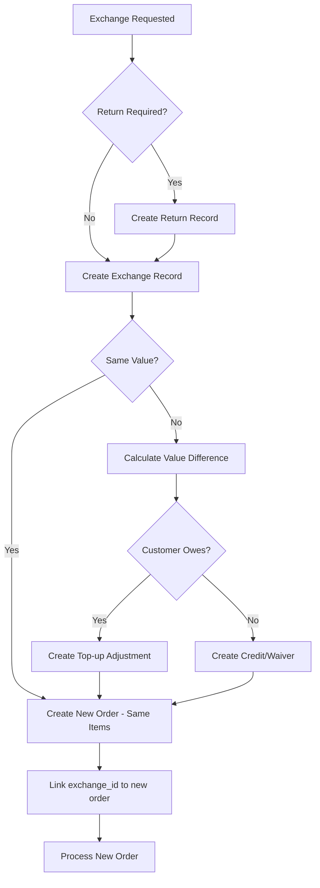
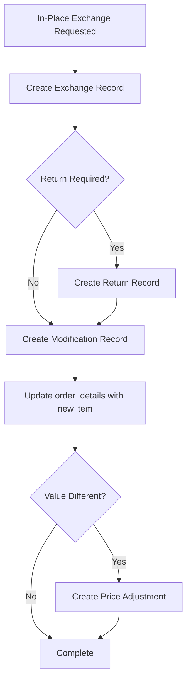
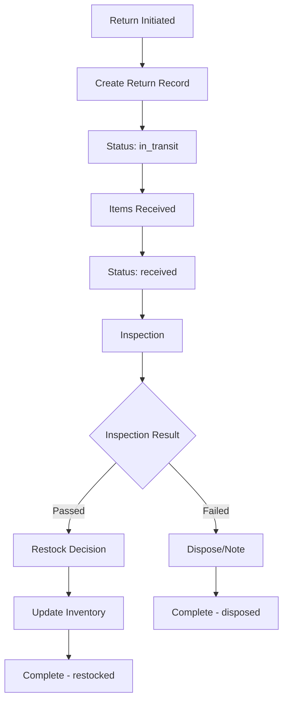
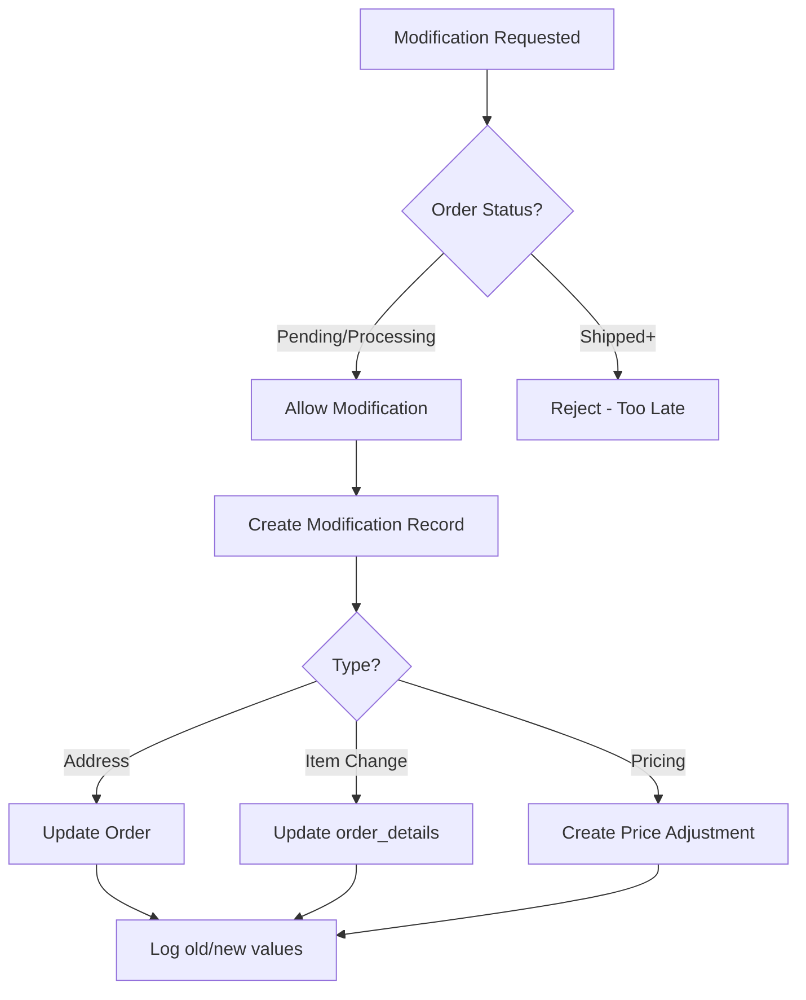

# Order Operations System: Exchanges, Returns, and Modifications

## Current State

Your system has:

- `orders` and `order_details` tables with status tracking
- `order_cancellations` table with audit trail
- Basic return fields on `order_details` (`return_status`, `returned_quantity`)
- No exchange tracking
- No order modification history

## New Tables to Create

### 1. Order Returns Table (`order_returns`)

Dedicated table for return workflow (replacing basic fields on `order_details`):

```sql
order_returns
├── id (PK)
├── order_id (FK → orders)
├── order_detail_id (FK → order_details)
├── return_type: 'customer_return', 'delivery_failed', 'platform_return'
├── return_reason_id (FK → return_reason)
├── return_status: 'requested', 'approved', 'in_transit', 'received', 'inspecting', 'completed', 'rejected'
├── returned_quantity
├── inspection_status: 'pending', 'passed', 'failed', 'partial'
├── inspection_notes
├── restock_decision: 'restock', 'dispose', 'repair', 'exchange'
├── restocked_quantity
├── platform_return_reference
├── initiated_by_user_id
├── timestamps (requested_at, received_at, completed_at)
```

### 2. Return Reason Lookup (`return_reason`)

```sql
return_reason
├── reason_id (PK)
├── reason_code: 'WRONG_ITEM', 'DAMAGED', 'NOT_AS_DESCRIBED', 'CHANGED_MIND', etc.
├── reason_name
├── reason_type: 'customer', 'platform', 'delivery'
├── requires_inspection (boolean)
├── is_active
```

### 3. Order Exchanges Table (`order_exchanges`)

Tracks exchange relationships:

```sql
order_exchanges
├── id (PK)
├── original_order_id (FK → orders)
├── original_detail_id (FK → order_details)
├── exchange_type: 'same_value', 'different_value', 'in_place'
├── exchange_reason_id (FK → exchange_reason)
├── exchange_status: 'requested', 'approved', 'processing', 'shipped', 'completed', 'cancelled'
├── -- For linked exchanges (new order created)
├── new_order_id (FK → orders, nullable)
├── new_detail_id (FK → order_details, nullable)
├── -- For in-place exchanges (same order modified)
├── exchanged_item_id (FK → items, nullable) -- new item if in-place
├── exchanged_quantity
├── -- Value adjustment
├── value_difference (positive = customer pays more, negative = credit)
├── adjustment_status: 'pending', 'paid', 'waived', 'credited'
├── -- Return tracking
├── return_id (FK → order_returns, nullable) -- links to return if item needs to come back
├── initiated_by_user_id
├── timestamps
```

### 4. Exchange Reason Lookup (`exchange_reason`)

```sql
exchange_reason
├── reason_id (PK)
├── reason_code: 'WRONG_SIZE', 'WRONG_COLOR', 'DEFECTIVE', 'CUSTOMER_PREFERENCE', etc.
├── reason_name
├── requires_return (boolean) -- whether original item must be returned
├── is_active
```

### 5. Order Modifications Table (`order_modifications`)

Full audit trail for all order changes:

```sql
order_modifications
├── id (PK)
├── order_id (FK → orders)
├── order_detail_id (FK → order_details, nullable) -- null for order-level changes
├── modification_type: 'address', 'item_add', 'item_remove', 'item_change', 'quantity', 'pricing'
├── field_changed: 'shipping_address', 'recipient_name', 'resolved_item_id', 'quantity', etc.
├── old_value (JSONB) -- stores previous value
├── new_value (JSONB) -- stores new value
├── modification_reason
├── modified_by_user_id (FK → users)
├── modified_at
```

### 6. Order Price Adjustments Table (`order_price_adjustments`)

Tracks top-ups, reductions, or no-charge modifications:

```sql
order_price_adjustments
├── id (PK)
├── order_id (FK → orders)
├── order_detail_id (FK → order_details, nullable)
├── adjustment_type: 'top_up', 'reduction', 'waived', 'exchange_difference'
├── adjustment_reason
├── original_amount
├── adjustment_amount (positive or negative)
├── final_amount
├── related_exchange_id (FK → order_exchanges, nullable)
├── related_modification_id (FK → order_modifications, nullable)
├── status: 'pending', 'applied', 'cancelled'
├── created_by_user_id
├── applied_at
├── timestamps
```

## Data Flow Diagrams

### Exchange Flow (Linked New Order)




### Exchange Flow (In-Place Modification)




### Return Flow




### Modification Flow




## Key Files to Create/Modify

### Database Layer

- [migrations/005_order_operations.sql](migrations/005_order_operations.sql) - New tables, indexes, seed data
- [alembic/versions/XXXX_add_order_operations.py](alembic/versions/) - Alembic migration

### Models ([app/models/orders.py](app/models/orders.py))

Add new models:

- `ReturnReason`
- `OrderReturn`
- `ExchangeReason`
- `OrderExchange`
- `OrderModification`
- `OrderPriceAdjustment`

### Seed Data

Add to [migrations/004_seed_data.sql](migrations/004_seed_data.sql) or new file:

- Return reasons (WRONG_ITEM, DAMAGED, NOT_AS_DESCRIBED, CHANGED_MIND, DELIVERY_FAILED, etc.)
- Exchange reasons (WRONG_SIZE, WRONG_COLOR, DEFECTIVE, CUSTOMER_PREFERENCE, UPGRADE, DOWNGRADE)

## Business Rules

**Modification Timing:**

- Address/details: Only when `order_status` IN ('pending', 'confirmed', 'processing')
- Item changes: Only when `order_status` IN ('pending', 'confirmed')
- Price adjustments: Any time before 'delivered', with audit trail

**Exchange Rules:**

- Same value: No price adjustment needed
- Different value: Create `order_price_adjustments` record
- Top-up: Customer pays difference
- Reduction: Credit or waive
- No charge: Mark adjustment as 'waived'

**Return Inspection:**

- All returns go through inspection by default
- Inspection determines: restock, dispose, repair, or exchange
- Inventory updated only after inspection complete
