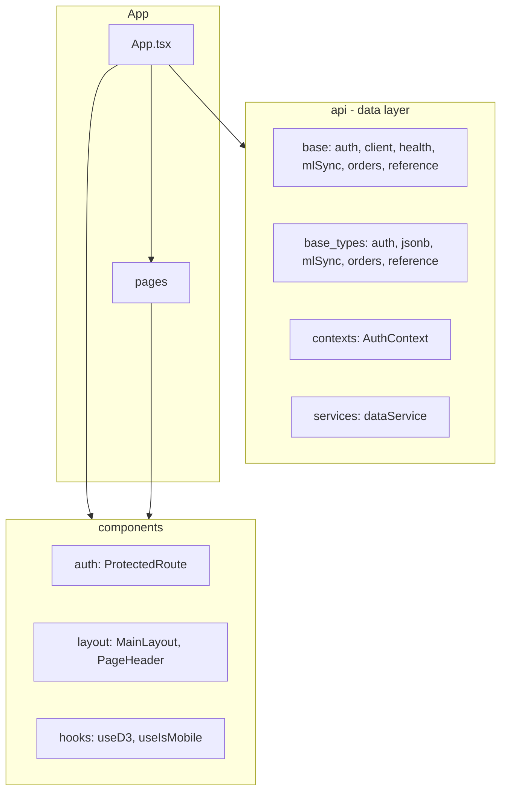
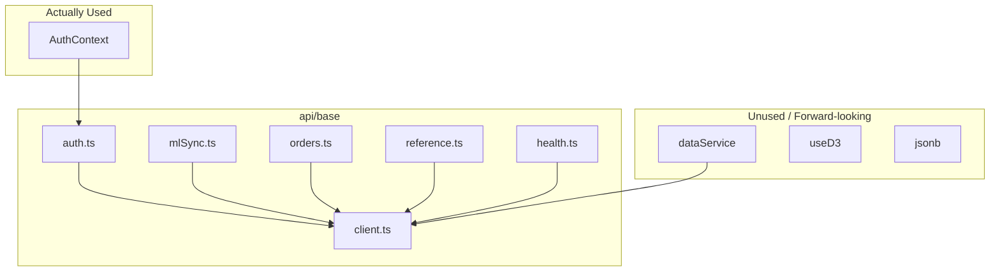

# Frontend File Structure Simplification Plan

## User Requirements

1. **Data layer:** `types`, `services`, `context`, and `api` should be together in one file (or one consolidated module).
2. **UI layer:** `layout` and `theme` should be together in one file (or one consolidated module).

## Current Structure (28 source files)

```
frontend/src/
├── api/                           # Data layer (types + services + context + api)
│   ├── base/                      # API calls
│   │   ├── auth.ts
│   │   ├── client.ts
│   │   ├── health.ts
│   │   ├── mlSync.ts
│   │   ├── orders.ts
│   │   └── reference.ts
│   ├── base_types/                # TypeScript types
│   │   ├── auth.ts
│   │   ├── jsonb.ts
│   │   ├── mlSync.ts
│   │   ├── orders.ts
│   │   └── reference.ts
│   ├── contexts/
│   │   └── AuthContext.tsx
│   └── services/
│       └── dataService.ts
├── components/
│   ├── auth/
│   │   └── ProtectedRoute.tsx
│   ├── hooks/
│   │   ├── useD3.ts
│   │   └── useIsMobile.ts
│   └── layout/
│       ├── MainLayout.tsx
│       └── PageHeader.tsx
├── pages/
│   ├── DashboardPage.tsx
│   ├── LoginPage.tsx
│   ├── MLSyncPage.tsx
│   ├── NotFoundPage.tsx
│   ├── OrderImportPage.tsx
│   └── ReferencePage.tsx
├── App.tsx
├── index.css                      # Theme via Tailwind @theme (no theme/ folder)
└── main.tsx
```

**Implemented:** Rule 1 (types, services, context, api together) is satisfied under `api/`.  
**Partial:** Rule 2 (layout + theme) — layout is in `components/layout/`; theme lives in `index.css` via Tailwind `@theme`, not a separate theme file.

---

## 1. Component Structure (Current)

**Current:** `components/auth/ProtectedRoute.tsx`, `components/layout/MainLayout.tsx`, `components/layout/PageHeader.tsx`, `components/hooks/useD3.ts`, `components/hooks/useIsMobile.ts`

Layout and PageHeader are already grouped under `components/layout/`. Auth and hooks have their own subfolders. No flattening needed unless you prefer fewer subfolders.

---

## 2. Barrel Files (Optional)

**API barrel:** Create [frontend/src/api/index.ts](frontend/src/api/index.ts) that re-exports from `base/`, `base_types/`, `contexts/`, `services/`.

**Benefit:** Consumers can use `import { login, useAuth } from '../api'` instead of separate paths. Current imports use `./api/contexts/AuthContext`, `./api/base/auth`, etc.

---

## 3. Type Files (api/base_types/)

**Current:** 5 type files under [frontend/src/api/base_types/](frontend/src/api/base_types/):

| File | Used By |
|------|---------|
| auth.ts | AuthContext, api/base/auth |
| jsonb.ts | **Never imported** |
| mlSync.ts | api/base/mlSync |
| orders.ts | api/base/orders |
| reference.ts | api/base/reference |

Types are already colocated with the data layer under `api/`. Further consolidation (e.g. single `base_types.ts`) is optional.

---

## 4. Unused / Forward-Looking Code

These files are not imported anywhere:

| File | Purpose |
|------|---------|
| [api/base/health.ts](frontend/src/api/base/health.ts) | Health check endpoint |
| [api/services/dataService.ts](frontend/src/api/services/dataService.ts) | Multi-DB fetch abstraction (backend does not implement yet) |
| [api/base_types/jsonb.ts](frontend/src/api/base_types/jsonb.ts) | JSONB column types |
| [components/hooks/useD3.ts](frontend/src/components/hooks/useD3.ts) | D3 + React integration for future charts |

**Optional:** Merge `health.ts` into [api/base/client.ts](frontend/src/api/base/client.ts) as `checkHealth()` export.

---

## 5. API Modules (api/base/)

**Current:** 6 API files under [frontend/src/api/base/](frontend/src/api/base/). `auth.ts` is used by AuthContext; `mlSync`, `orders`, `reference` are ready for future pages.

No consolidation needed. Domain separation is preserved.

---

## 6. Consolidation Rules (User Requirements)

**Rule 1 – Data layer in one place:**  
`types`, `services`, `context`, and `api` should be together in one file (or one consolidated module).

**Status:** Implemented. All live under `api/`:
- `api/base/` — API calls
- `api/base_types/` — types
- `api/contexts/` — AuthContext
- `api/services/` — dataService

**Rule 2 – UI layer in one place:**  
`layout` and `theme` should be together in one file (or one consolidated module).

**Status:** Partial. Layout is in `components/layout/`. Theme is in `index.css` via Tailwind `@theme` (no separate theme file). To fully satisfy Rule 2, consider moving theme tokens into `components/layout/theme.ts` or a shared `ui/` module that exports both layout components and theme config.

---

## 7. What NOT to Change

- **Pages:** Each page has its own route and role. Do not merge.
- **api/base/client.ts:** Core API setup; do not merge other logic into it.

---

## Summary: Status and Optional Actions

| Item | Status |
|------|--------|
| **Rule 1 (types + services + context + api)** | Done — under `api/` |
| **Rule 2 (layout + theme)** | Partial — layout in `components/layout/`, theme in `index.css` |
| Add `api/index.ts` barrel | Optional — cleaner imports |
| Merge `health.ts` into `client.ts` | Optional — one less file |

---

## Current Architecture



## Dependency Overview




