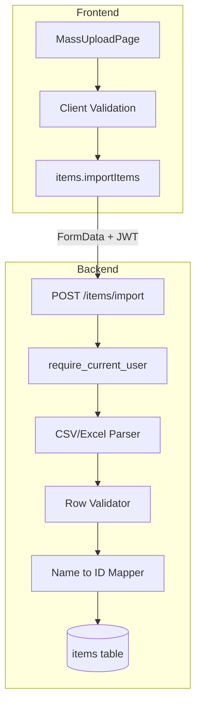

# Items Mass Upload Plan

## Context

The codebase already has:

- `**POST /api/v1/reference/load-items**` — Admin reference loader using `load_item_master()` with a fixed multi-sheet Excel format (Product Name, SKU Name, Internal CODE, BaseUOM). **No auth**, no frontend in catalog.
- `**ItemCreate`** schema — Full item fields: `item_name`, `master_sku`, `sku_name`, `description`, `uom_id`, `brand_id`, `item_type_id`, `category_id`, `is_active`, etc.
- **Auth** — JWT via `require_current_user`, axios interceptor injects `Authorization: Bearer <token>`, 401 redirects to `/login`.
- **CORS** — `allow_credentials=True`, origins from `settings.cors_origins`.

This plan adds an **items-specific mass upload** under the catalog, with auth, flexible format, and full validation.

---

## Architecture Overview




---

## 1. Backend

### 1.1 New Endpoint: `POST /api/v1/items/import`

**File:** [backend/app/routers/items.py](backend/app/routers/items.py)

- **Auth:** `Depends(require_current_user)` — same as `create_item`.
- **Request:** `multipart/form-data` with `file: UploadFile` (CSV or Excel).
- **Response:** Structured result with `total_rows`, `success_rows`, `error_rows`, `errors[]` (per-row `{ row, error, preview }`).

**Validation (server-side):**


| Check              | HTTP Code      | Detail                                      |
| ------------------ | -------------- | ------------------------------------------- |
| File type          | 422            | `.csv`, `.xlsx`, `.xls` only                |
| File size          | 413            | Max 10 MB (align with order import)         |
| Empty file         | 422            | "Uploaded file is empty"                    |
| Header row         | 422            | Required columns: `item_name`, `master_sku` |
| Per-row validation | 200 + errors[] | Invalid FK, duplicate SKU, max length, etc. |


**Column mapping:**

- **Required:** `item_name`, `master_sku`
- **Optional:** `sku_name`, `description`, `uom`, `brand`, `category`, `item_type`, `is_active`
- **Variation (optional):** `variation_name_1`, `variation_values_1`, `variation_name_2`, `variation_values_2`
- **Name resolution:** Map `uom` (name) → `uom_id`, `brand` (name) → `brand_id`, etc. (reuse pattern from [loader.py](backend/app/services/reference_loader/loader.py) `_get_or_create_uom`). Unknown names → validation error for that row.

**Processing strategy:**

- Parse file into rows.
- Validate each row (required fields, FK resolution, `master_sku` uniqueness).
- Use a single transaction: insert valid rows, collect errors for invalid rows.
- Return summary + per-row errors (no partial commit on validation failure if you prefer strict mode; or allow partial success like order import).

### 1.2 New Service: `app/services/items_import/`

**Structure:**

```
backend/app/services/items_import/
├── __init__.py
├── parser.py      # parse_csv, parse_excel → list[dict]
├── validator.py   # validate_row, resolve_fks
└── importer.py    # import_items(session, file_bytes, filename) → ImportResult
```

**ImportResult schema (Pydantic or dataclass):**

```python
@dataclass
class ImportResult:
    total_rows: int
    success_rows: int
    error_rows: int
    errors: list[dict]  # { "row": int, "error": str, "master_sku": str }
```

**Parser:**

- CSV: `pandas.read_csv` or `csv.DictReader`, `dtype=str`, `encoding="utf-8-sig"`.
- Excel: `pandas.read_excel`, single sheet (or first sheet), `header=0`.
- Normalize column names (strip, lowercase, map common aliases: "Product Name" → "item_name", "Internal CODE" → "master_sku").

**Validator:**

- Required: `item_name` (max 500), `master_sku` (max 100, unique).
- Optional: `sku_name`, `description`, `uom`, `brand`, `category`, `item_type`, `is_active`.
- Resolve names to IDs via DB lookups (cache in memory per import).
- Reject rows with unknown FK names or duplicate `master_sku` in file or DB.
- Build `variations_data` JSONB from flat variation columns (see §6 Variation Handling).

### 1.3 Security

- **JWT:** Endpoint uses `require_current_user`; no changes to auth flow.
- **CORS:** Already configured; `withCredentials: true` on client.
- **CSRF:** Stateless JWT API; no cookie-based session. If you add CSRF later, use SameSite cookies or double-submit pattern.
- **File limits:** 10 MB max, reject non-CSV/Excel MIME types.
- **Input sanitization:** Strip/truncate strings to schema limits before insert.

---

## 2. Frontend

### 2.1 New Page: Mass Upload

**Route:** `/catalog/items/upload` (or a modal/drawer from Items list)

**File:** `frontend/src/pages/items/ItemsMassUploadPage.tsx`

**UI elements:**

1. **File input** — Accept `.csv`, `.xlsx`, `.xls`. Drag-and-drop optional.
2. **Template download** — Link to download a CSV template with headers: `item_name,master_sku,sku_name,description,uom,brand,category,item_type,is_active,variation_name_1,variation_values_1,variation_name_2,variation_values_2`.
3. **Client-side validation before submit:**
  - File type (extension + MIME if available).
  - File size (e.g. 10 MB).
  - Non-empty file.
4. **Submit** — `FormData` with `file`, POST to `/api/v1/items/import`.
5. **Progress** — Disable form, show spinner during request.
6. **Result display:**
  - Success: "X items imported successfully."
  - Partial: "X succeeded, Y failed." + expandable error list (row, error, preview).
  - Full failure: Show API error message.

### 2.2 API Client

**File:** [frontend/src/api/base/items.ts](frontend/src/api/base/items.ts)

```typescript
export interface ItemsImportResult {
  total_rows: number;
  success_rows: number;
  error_rows: number;
  errors: Array<{ row: number; error: string; master_sku?: string }>;
}

export async function importItems(file: File): Promise<ItemsImportResult> {
  const formData = new FormData();
  formData.append('file', file);
  const res = await apiClient.post<ItemsImportResult>('/items/import', formData, {
    headers: { 'Content-Type': 'multipart/form-data' },
  });
  return res.data;
}
```

**File:** [frontend/src/api/base_types/items.ts](frontend/src/api/base_types/items.ts) — Add `ItemsImportResult` type.

### 2.3 Client-Side Validation

- **File type:** `['.csv', '.xlsx', '.xls'].includes(ext)`.
- **File size:** `file.size <= 10 * 1024 * 1024`.
- **Empty:** `file.size > 0`.
- Show inline errors before allowing submit.

### 2.4 Error Handling

- Use `try/catch` around `importItems()`.
- Parse `error.response?.data?.detail` (string or array of validation errors).
- Display user-friendly messages; log full error for debugging.
- On 401: Existing interceptor redirects to login.

### 2.5 Navigation

- Add route in [App.tsx](frontend/src/App.tsx): `/catalog/items/upload` → `ItemsMassUploadPage`.
- Add "Mass Upload" button/link in [ItemsListPage](frontend/src/pages/items/ItemsListPage.tsx) or in the catalog nav.

---

## 3. CSV Template Format

**Recommended columns (order flexible):**

| Column              | Required | Description                                              |
| ------------------- | -------- | -------------------------------------------------------- |
| item_name           | Yes      | Product name (max 500)                                   |
| master_sku          | Yes      | Unique SKU (max 100, no spaces)                          |
| sku_name            | No       | Display SKU name                                         |
| description         | No       | Item description                                         |
| uom                 | No       | UOM name (e.g. "Each", "Box") — resolved to uom_id      |
| brand               | No       | Brand name — resolved to brand_id                        |
| category            | No       | Category name — resolved to category_id                  |
| item_type           | No       | Item type name — resolved to item_type_id                |
| is_active           | No       | true/false, 1/0, yes/no (default: true)                  |
| variation_name_1    | No       | First variation dimension label (e.g. "Colour")          |
| variation_values_1  | No       | Semicolon-separated values for dim 1 (e.g. "Red;Blue")   |
| variation_name_2    | No       | Second variation dimension label (e.g. "Size") — optional|
| variation_values_2  | No       | Semicolon-separated values for dim 2 (e.g. "S;M;L")     |

**Example rows:**

```csv
item_name,master_sku,sku_name,description,uom,brand,category,item_type,is_active,variation_name_1,variation_values_1,variation_name_2,variation_values_2
Plain Tee,PLAIN-001,Plain Tee Display,A plain tee,Each,My Brand,Apparel,Outgoing Product,true,,,,
T-Shirt,TSHIRT-001,,A t-shirt with variations,Each,My Brand,Apparel,Outgoing Product,true,Colour,Red;Blue;Green,Size,S;M;L
```


---

## 4. Implementation Order (Completed)

1. **Backend service** — `items_import` parser, validator, importer.
2. **Backend endpoint** — `POST /items/import` in items router.
3. **Frontend API** — `importItems()`, `ItemsImportResult` type.
4. **Frontend page** — `ItemsMassUploadPage` with validation, submit, result display.
5. **Routing and nav** — Route + "Mass Upload" entry in catalog.
6. **Template** — Static CSV template file or generated download.

---

## 5. Variation Handling (Option 1 — Flat Columns)

### Decision

Three approaches were considered for encoding variations in a flat CSV/Excel file:

| Option | Description | Decision |
|--------|-------------|----------|
| **1 — Flat columns** | Fixed variation columns per row; backend generates cartesian product | **Chosen** |
| 2 — Parent + child rows | One parent row + one row per combination; supports per-combo SKU | Rejected — complex template |
| 3 — No variations in upload | Base item fields only; variations set in edit form | Rejected — insufficient |

**Rationale:** Option 1 keeps one row per item (familiar spreadsheet UX), requires no template-filling expertise, and matches the VariationBuilder's max-2-dimension model. Combination-level SKUs are intentionally left empty and filled via the item edit form after upload.

---

### CSV Columns

| Column              | Rules                                                                 |
| ------------------- | --------------------------------------------------------------------- |
| `variation_name_1`  | Required if any variation column is present. Max not enforced in CSV. |
| `variation_values_1`| Required if `variation_name_1` is set. Semicolon-separated values.   |
| `variation_name_2`  | Optional. Required if `variation_values_2` is provided.              |
| `variation_values_2`| Optional. Required if `variation_name_2` is provided.               |

**Accepted aliases** (case-insensitive, normalised by parser):

| Canonical key        | Accepted aliases                                      |
| -------------------- | ----------------------------------------------------- |
| `variation_name_1`   | `variation name 1`, `variation 1 name`               |
| `variation_values_1` | `variation values 1`, `variation 1 values`           |
| `variation_name_2`   | `variation name 2`, `variation 2 name`               |
| `variation_values_2` | `variation values 2`, `variation 2 values`           |

---

### Backend: `_build_variations_data()` (validator.py)

Parses the 4 flat columns and builds a `VariationsData` JSONB dict.

**Logic:**

1. If all 4 columns are absent/empty → return `(None, None)` → plain item, `has_variation = False`.
2. If `variation_name_1` is absent but others are present → row error.
3. If `variation_values_1` is absent → row error.
4. Split `variation_values_1` by `;`, strip whitespace, filter empty → `opts1`.
5. If `variation_name_2` / `variation_values_2` are both set → split `variation_values_2` → `opts2`.
6. Partial second dimension (name without values, or vice versa) → row error.
7. Generate cartesian product via `itertools.product(*combo_arrays)`.
8. Each combination: `{ "values": [...], "sku": "", "image": null }`.

**Output JSONB shape** (matches `VariationsData` TypeScript interface):

```json
{
  "attributes": [
    { "name": "Colour", "values": ["Red", "Blue", "Green"] },
    { "name": "Size",   "values": ["S", "M", "L"] }
  ],
  "combinations": [
    { "values": ["Red",   "S"], "sku": "", "image": null },
    { "values": ["Red",   "M"], "sku": "", "image": null },
    { "values": ["Red",   "L"], "sku": "", "image": null },
    { "values": ["Blue",  "S"], "sku": "", "image": null },
    { "values": ["Blue",  "M"], "sku": "", "image": null },
    { "values": ["Blue",  "L"], "sku": "", "image": null },
    { "values": ["Green", "S"], "sku": "", "image": null },
    { "values": ["Green", "M"], "sku": "", "image": null },
    { "values": ["Green", "L"], "sku": "", "image": null }
  ]
}
```

The resulting dict is stored in `items.variations_data` (JSONB). `has_variation` is set to `True` automatically.

---

### Validation Error Examples

| Scenario | Error message |
|----------|---------------|
| `variation_values_1` set but `variation_name_1` missing | `variation_name_1 is required when variation columns are provided` |
| `variation_name_1` set but `variation_values_1` missing | `variation_values_1 is required when variation_name_1 is set` |
| `variation_values_1 = "  ; ; "` (all blanks) | `variation_values_1 must contain at least one value (use ; to separate)` |
| `variation_name_2` set but `variation_values_2` missing | `variation_values_2 is required when variation_name_2 is set` |

---

### Frontend: Instructions Card

The "How to use" card in `ItemsMassUploadPage.tsx` has a dedicated step explaining the variation columns:

> For items with variations, fill in **variation_name_1** (e.g. *Colour*) and **variation_values_1** (e.g. *Red;Blue;Green*, semicolon-separated). Add a second dimension via **variation_name_2** / **variation_values_2** (optional). Combination SKUs can be set later in the item edit form.

The downloaded CSV template includes both a plain item row (variation columns empty) and a 2-dimension variation item row as concrete examples.

---

### Post-Upload Workflow

1. Upload CSV — combinations inserted with empty SKUs.
2. Open item in edit form → VariationBuilder renders the imported `variations_data`.
3. User fills in per-combination SKUs in the combination table.
4. Save → `variations_data` updated via `PATCH /items/{item_id}`.

---

## 7. Relationship to Existing `reference/load-items`


| Aspect   | reference/load-items                           | items/import (new)                          |
| -------- | ---------------------------------------------- | ------------------------------------------- |
| Auth     | None                                           | JWT required                                |
| Format   | Multi-sheet Excel, header row 4, fixed columns | CSV or single-sheet Excel, flexible columns |
| Fields   | item_name, master_sku, sku_name, BaseUOM       | Full ItemCreate fields + name lookup        |
| Location | Reference Data (admin)                         | Catalog (items)                             |
| Use case | One-time reference load                        | Ongoing catalog mass upload                 |


**Recommendation:** Keep both. Use `reference/load-items` for initial/admin bulk load; use `items/import` for catalog-facing mass upload with auth and flexible format.